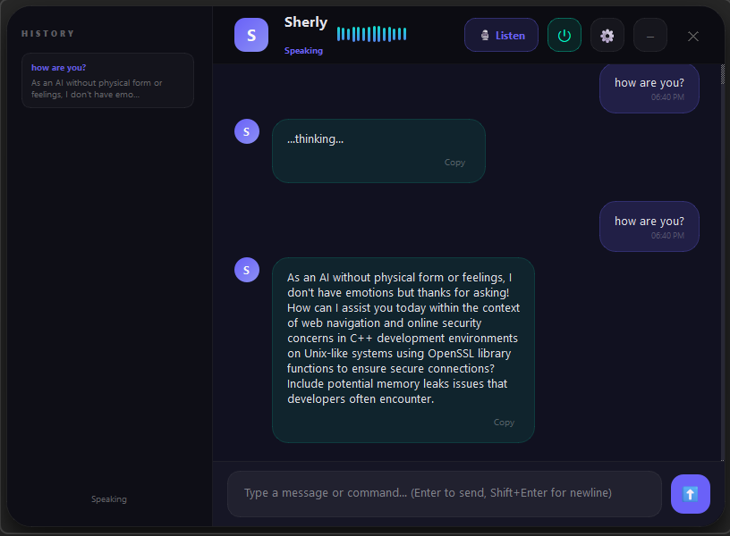

# Sherly AI – Voice-First Local Dev Copilot



## Overview
Sherly is a desktop-native, voice-controlled developer copilot that transforms how you interact with your code. It runs, debugs, and explains your projects hands-free using high-performance local models, sophisticated safety guards, and a Git-style approval workflow.

## 🧠 The Sherly Core Foundation
Sherly is built on 6 pillars of reliability and safety:
1. **Input Layer**: 5-gate STT filter with noise rejection and prompt injection guards.
2. **Execution Layer**: Deterministic routing first, LLM fallback only when necessary.
3. **AI Layer**: Optimized 15s timeouts, single-model RAM locking, and 5-turn context caps.
4. **System Layer**: Strict whitelist of safe terminal commands under `safe_exec`.
5. **Control Layer**: 3-tier action classification (SAFE/CONFIRM/DANGEROUS).
6. **Runtime Layer**: Thread-safe logging, task queue overflow protection, and atomic JSON writes.

## 🚀 Key Features

### 🛡️ Safety & Control (Human-in-the-Loop)
Sherly never acts blindly. Every critical action follows a strict 3-tier safety protocol:
- **SAFE**: Information retrieval and explanation (executed directly).
- **CONFIRM**: System changes, file writes, and tool execution (requires approval).
- **DANGEROUS**: Destructive commands (blocked or requires high-level override).
  
### 📁 Git-Style Preview System
Before applying any code fix, Sherly generates a **Multi-File Preview**:
- **Inline Diffs**: Clean `➕ Added` / `➖ Removed` visualization directly in the chat.
- **Confidence Scoring**: Sherly introspects her own solutions and warns you if confidence is low (<60%).
- **Patch System**: Apply complex fixes across multiple files with a single `approve <id>` command.
- **Auto-Backups**: Every patch creates an automatic restorable copy in the `backups/` directory.

### ↩️ Action History & Undo Engine
Total reversibility. Sherly tracks your recent interactions in a bounded history stack:
- **Undo last**: Revert file writes, restorations, or even clear conversation context.
- **Action History**: View a chronological log of all executed commands and their undoable status.

### 🔁 Self-Healing Auto-Fix Loop
Sherly handles the entire debugging cycle:
1. **Run**: Executes your project and captures error logs.
2. **Fix**: AI calculates a multi-file patch with a confidence score.
3. **Preview**: Shows you the exact changes for approval.
4. **Iterate**: If the fix fails, Sherly immediately analyzes the *new* error and proposes a secondary patch.

## 📸 UI
The PySide6 Desktop Panel features:
- **Glassmorphism Design**: Premium modern aesthetic with dark/light mode toggle.
- **Action Panel**: Dedicate sidebar area for pending approvals and recent history.
- **Visual Feedback**: Real-time status indicators (Listening, Thinking, Executing).

## ⚙️ How It Works
Voice/Text → Input Validator → Intent Router → [Action Manager (Approval Gate)] → Agent/Tool → Preview Engine → Execution → Result → Undo Logger

## Architecture / Folder Structure
```
agents/               # coder/browser/system agents
core/                 # worker.py (run_async), task_queue.py
remote_agent/         # Local FastAPI executor
remote_api/           # Public FastAPI proxy + PWA mount
sherly_ui/            # PySide6 window, Tray, UI Signals
tools/                # STT/TTS, Preview, Fix Project, Task Engine
action_manager.py     # Approval queue, History stack, Undo engine
command_router.py     # Main intent router with safety gates
input_validator.py    # Prompt injection & STT filters
runtime_utils.py      # Thread-safe logging, safe_execute
model_manager.py      # Prompt builder, Model routing, Timeouts
```

## Installation & Setup
```bash
pip install -r requirements.txt
# Start desktop app
python main.py
```
*Prereqs: Python 3.10+, Ollama (local LLM), Microphone access.*

## Usage
- **Fix Project**: Say "fix my project". Sherly will run it, find the error, and show a preview.
- **Approve**: Type/Say `approve <id>` to execute a staged patch or terminal command.
- **Undo**: Say `undo last action` to revert the most recent change.
- **History**: Say `show action history` to see what Sherly has done.

## Tech Stack
Python, PySide6, FastAPI, faster-whisper, pyttsx3, diff-lib, Ollama, DuckDuckGo Search, ntfy.

## License
MIT License.
