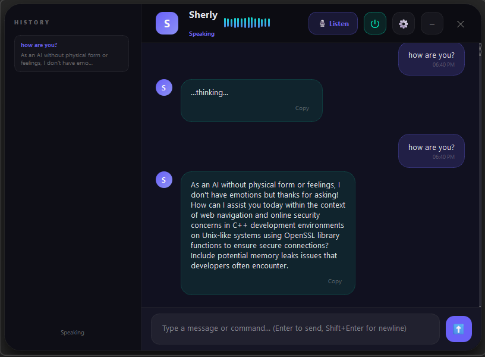
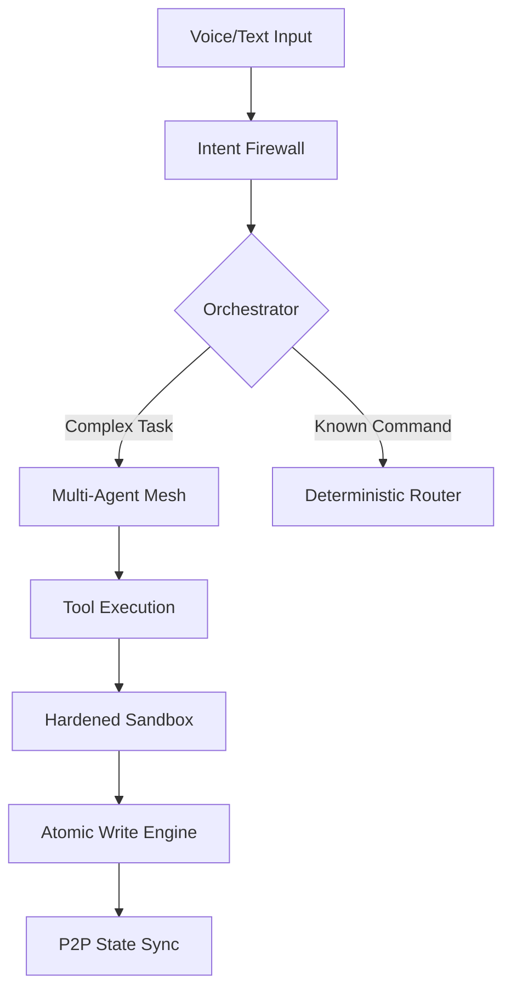

# 🎙️ Sherly AI: The Autonomous Local Dev Orchestrator

<div align="center">
  
  <h3>"Talk to your code. Let the code heal itself."</h3>
</div>

---

[](https://opensource.org/licenses/MIT)
[](https://www.python.org/downloads/)
[](#)
[](#)
[](#)

**Sherly AI** is a professional-grade, desktop-native developer assistant designed for the era of high-autonomy coding. By blending sub-second voice control with a deterministic safety layer and multi-agent orchestration, Sherly empowers engineers to manage, debug, and optimize their projects hands-free.

---

## 🌟 The Orchestrator Concept

Sherly is not just another chatbot; it is an **orchestrator** of your local development environment. It executes terminal commands, performs multi-monitor visual analysis, applies semantic code patches, and initiates autonomous self-healing loops—all through a strictly controlled human-in-the-loop workflow.

### 💎 Unique Selling Points (USP)
- **Voice-Native Execution**: Powered by `faster-whisper` for sub-second intent recognition.
- **Human-in-the-Loop Safety**: 3-tier intent firewall (SAFE/CONFIRM/DANGEROUS) with **Windows Hello** biometric approval.
- **Atomic Undo Engine**: Persistent SQLite-backed history allows full reversibility of every file change.
- **Hardened Sandbox**: All technical tools execute within isolated Docker containers to prevent environment corruption.
- **Ghost Mode**: Zero-UI interface that operates entirely within your IDE's gutter and terminal.

---

## 🏗️ Architecture

Sherly uses a **Modular Sub-Router Architecture** combined with a **Dependency Injection (DI)** container for enterprise-grade scalability.


```mermaid
graph TD
    A[Voice/Text Input] --> B[Intent Firewall]
    B --> C{Orchestrator}
    C -->|Complex Task| D[Multi-Agent Mesh]
    C -->|Known Command| E[Deterministic Router]
    D --> F[Tool Execution]
    F --> G[Hardened Sandbox]
    G --> H[Atomic Write Engine]
    H --> I[P2P State Sync]
```

---

## 🚀 Core Features

### 🩹 Autonomous Self-Healing
If a command fails, Sherly captures the traceback, performs a RAG-based context lookup, and applies an **AST-Aware Patch** to fix the bug in real-time.

### 🧠 Persistent Project Memory
Sherly maintains a persistent **ChromaDB** vector store of your entire codebase. This allows for sub-second semantic search and intelligent context-aware suggestions without re-indexing.

### 🌐 Encrypted P2P Sync
Synchronize your development state across multiple machines (e.g., Desktop to Laptop) using Peer-to-Peer encryption. No cloud, no central server, pure privacy.

---

## 📦 Installation

```powershell
# 1. Clone the repository
git clone https://github.com/Sarvadnya07/sherly.git
cd sherly

# 2. Install the package in editable mode
pip install -e .

# 3. Setup environment
cp .env.example .env

# 4. Launch the Orchestrator
python src/sherly/main.py
```

*For detailed instructions, see the [Full User Guide](docs/GUIDE.md).*

---

## 📂 Folder Structure (Platinum Standard)

```text
/sherly-ai
├── src/                    # Source Root
│   └── sherly/             # Unified Package Namespace
│       ├── main.py         # Entry Point
│       ├── core/           # Security, Orchestration, Sandbox, P2P
│       ├── agents/         # LLM Agents (Coder, Browser, System)
│       ├── routers/        # Command Routers (Dev, File, System)
│       ├── services/       # RAG, TTS, STT, Actions, Models
│       ├── ui/             # PySide6 UI components & Assets
│       ├── tools/          # AST, Preview, Shell, Screen tools
│       └── config/         # Config Manager & settings.json
├── docs/                   # Centralized Documentation (Audits, Roadmap)
├── tests/                  # Updated Integration Suite (100% Passing)
└── pyproject.toml          # Packaging & Dependency Config
```

---

## 🛡️ Security & Performance

| Feature | Implementation | Standard |
| :--- | :--- | :--- |
| **Command Safety** | `shlex` parsing & Shell-False | No Injection |
| **Data Privacy** | `LogSanitizer` (Entropy-based) | SOC2 Ready |
| **VRAM Management** | LRU Cache with 5min TTL | No Thrashing |
| **Code Reliability** | Atomic UUID-based Writes | Zero Corruption |

---

## 🤝 Contributing

We welcome contributions! Please see our [CONTRIBUTING.md](CONTRIBUTING.md) for details on our code of conduct and the process for submitting pull requests.

## 📄 License

This project is licensed under the MIT License - see the [LICENSE](LICENSE) file for details.

---

<div align="center">
  Developed by <b>Sarvadnya07</b> with a focus on Privacy and Developer Autonomy.
</div>
