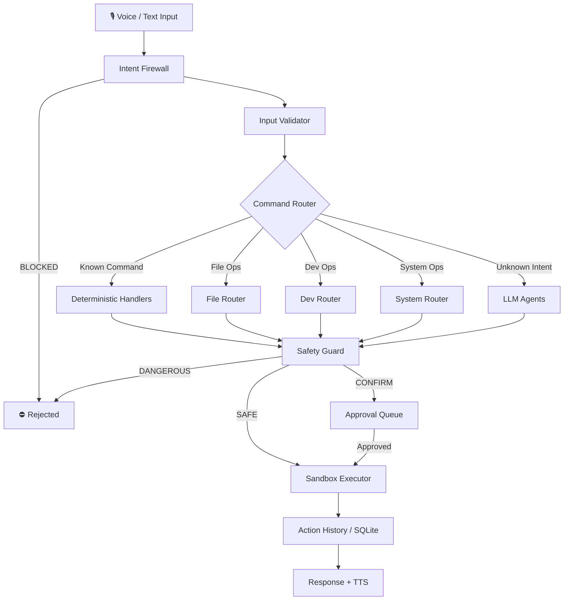

# Sherly AI – Voice-First Local Developer Orchestrator

<div align="center">


<h1>Sherly AI</h1>

<p><strong>The Autonomous Local Developer Orchestrator</strong></p>

<p><em>"Talk to your code. Let the code heal itself."</em></p>

<p>


</p>

</div>

---

## 📖 Overview

**Sherly AI is a production-grade, desktop-native, voice-first AI developer copilot and local development orchestrator** designed for hands-free interaction with your codebase.

Unlike conventional cloud-dependent chat interfaces, Sherly bridges the gap between natural-language intent and safe, deterministic system execution.

Sherly can:

* Listen to voice or text commands
* Understand project-level developer intent
* Inspect files and project structure
* Execute deterministic development workflows
* Run tests and development commands
* Diagnose errors and retrieve relevant project context
* Generate multi-file fixes
* Preview proposed changes before applying them
* Require explicit approval for consequential actions
* Track and undo supported modifications
* Maintain persistent local project memory
* Coordinate specialized AI agents

Sherly is built around one core principle:

> **Deterministic safety first. LLM as a last resort.**

Known commands are handled through deterministic routing before an AI model is invoked. This keeps common workflows fast, predictable, auditable, and resource-efficient while still allowing local LLM-powered agents to handle complex or ambiguous tasks.

**Supported platforms:** Windows · macOS · Linux

---

## 🎯 Why Sherly Exists

Modern AI coding assistants can introduce several engineering problems:

* Hallucination-driven actions
* Unpredictable command execution
* Excessive dependence on cloud APIs
* Limited visibility into AI-generated changes
* Difficult recovery from unintended modifications
* High local resource consumption
* Weak separation between safe and destructive operations

Sherly was designed to address these problems through:

1. **Local independence** — speech recognition, project indexing, and local LLM inference can run without sending source code to a cloud service.
2. **Deterministic execution** — known workflows bypass unnecessary LLM reasoning.
3. **Human-in-the-loop control** — consequential operations can require explicit approval.
4. **Reversible actions** — file states and action history enable supported operations to be undone.
5. **Patch visibility** — AI-generated modifications are presented as reviewable multi-file patches before application.
6. **Defense in depth** — input validation, semantic security checks, command classification, sandboxing, and secret redaction protect the execution environment.

---

# 🧠 Core Architecture

Sherly is built around **six reliability and safety pillars**.

### 1. Input Layer

Every voice or text request passes through validation and security checks.

* Speech-to-text noise filtering
* Input deduplication and debounce
* Regex-based prompt-injection detection
* Semantic security checks
* Input validation

### 2. Execution Layer

Sherly follows a deterministic-first strategy:

```text
Known command
      ↓
Deterministic handler
```

If deterministic routing cannot confidently handle the request:

```text
Unknown / complex intent
      ↓
Local LLM agent
```

The LLM is therefore reserved for tasks that actually require reasoning.

### 3. AI Layer

The model lifecycle is designed for predictable resource usage.

* Hard LLM call timeouts
* Single active-model locking
* Automatic idle model unloading
* Circuit-breaker protection
* Bounded conversation context
* Multiple model-provider support
* Local Ollama integration
* Optional cloud model providers

### 4. System Layer

Terminal and system execution is restricted through controlled tooling.

* Command classification
* `shlex.split()`
* `shell=False`
* Optional Docker sandboxing
* Destructive-command blocking
* Controlled subprocess execution

### 5. Control Layer

Every consequential action is assigned a safety level:

| Level         | Behavior                                    |
| ------------- | ------------------------------------------- |
| **SAFE**      | Executes directly                           |
| **CONFIRM**   | Requires explicit developer approval        |
| **DANGEROUS** | Blocked or requires a higher-level override |

### 6. Runtime Layer

Sherly protects application stability through:

* Thread-safe background processing
* Task queue protection
* Atomic file writes
* Persistent action history
* Automatic backups
* Secret redaction
* Resilient model execution
* Resource management

---

# 🚀 Key Features

## 🎙️ Voice-Native Development

Sherly is designed for hands-free development.

Use the global hotkey:

```text
Ctrl + Shift + S
```

or use the microphone button in the desktop UI.

Voice commands are processed locally through `faster-whisper`.

Example commands:

```text
"Sherly, scan this project and tell me what it does."

"Sherly, fix the last error in my terminal."

"Sherly, run the tests."

"Sherly, explain config_manager.py."

"Sherly, open VSCode."

"Sherly, undo."
```

Text input is also supported directly through the desktop interface.

---

# 🛡️ Multi-Tier Safety & Human-in-the-Loop Control

Sherly never blindly executes every request.

The security pipeline is:

```text
Voice / Text
     ↓
Regex Injection Detection
     ↓
Semantic Security Firewall
     ↓
Input Validation
     ↓
Intent / Command Router
     ↓
Safety Classification
     ↓
Execution / Approval / Block
```

The security system combines:

* Regex-based injection detection
* Semantic jailbreak detection
* Command classification
* Shell injection protection
* Sandbox isolation
* Secret redaction
* Approval queues
* Atomic file operations

## Action Classification

### SAFE

Information retrieval and non-destructive operations.

Examples:

```text
Explain a file
List project files
Inspect configuration
Show project status
Run read-only analysis
```

These can execute immediately.

### CONFIRM

Operations that modify the environment or execute consequential workflows.

Examples:

```text
Write a file
Modify source code
Install a dependency
Execute a development command
Apply a patch
```

These are staged for explicit developer approval.

### DANGEROUS

Destructive or high-risk operations.

Examples include destructive filesystem or shell operations.

These are blocked by default or require a higher-level override.

---

# 🔍 Git-Style Patch Preview & Approval

Before applying an AI-generated code change, Sherly produces a **multi-file patch preview**.

Instead of silently modifying your project, Sherly shows exactly what is proposed.

The preview can include:

* Added lines
* Removed lines
* Modified files
* Confidence score
* Action identifier
* Approval state

Example:

```text
Sherly proposed changes

src/auth.py
  ➕ Added authentication validation
  ➖ Removed insecure fallback

src/config.py
  ➕ Added environment variable handling

Confidence: 87%

Action ID: patch_42
```

The staged patch can then be approved:

```text
approve patch_42
```

Every supported patch can also be backed up before modification.

---

# ↩️ Atomic Undo & Action History

Sherly is designed around reversibility.

Before modifying supported files, Sherly preserves their previous state.

You can undo changes using:

```text
undo
```

or:

```text
undo last action
```

Supported tracked operations can include:

* File modifications
* File restorations
* Previous patches
* Other tracked operations

View previous operations with:

```text
show action history
```

Action history is persisted through SQLite.

---

# 🩹 Self-Healing Development Loop

Sherly can automate the development debugging cycle while keeping the developer in control.

```text
┌───────────┐
│    Run    │
└─────┬─────┘
      ↓
┌───────────┐
│  Capture  │
│   Error   │
└─────┬─────┘
      ↓
┌───────────┐
│    RAG    │
│  Context  │
└─────┬─────┘
      ↓
┌───────────┐
│ AI Fix    │
│ Proposal  │
└─────┬─────┘
      ↓
┌───────────┐
│  Preview  │
└─────┬─────┘
      ↓
┌───────────┐
│ Approval  │
└─────┬─────┘
      ↓
┌───────────┐
│   Apply   │
│   Patch   │
└─────┬─────┘
      ↓
   Run Again
      │
      └──────→ If failure → Analyze new error
```

The workflow is:

1. **Run** — Execute the project or relevant command.
2. **Capture** — Collect the error and traceback.
3. **Understand** — Retrieve relevant project context through RAG.
4. **Fix** — Generate a proposed multi-file patch.
5. **Preview** — Show the exact changes.
6. **Approve** — Wait for developer authorization.
7. **Apply** — Safely execute the patch.
8. **Iterate** — If the fix fails, analyze the new error and propose another solution.

This creates a practical **self-healing development workflow without removing the human from the approval loop**.

---

# 🧠 Persistent Project Memory

Sherly includes a local **ChromaDB-backed RAG system** for persistent project knowledge.

Projects can be indexed into a local vector store, allowing Sherly to retrieve semantically relevant source files when answering questions or diagnosing failures.

### Benefits

* Project-aware explanations
* Better debugging context
* Semantic source-code search
* Persistent local memory
* Local project indexing
* Parallel indexing with `ThreadPoolExecutor`
* No cloud dependency for project indexing

Example:

```text
User:
"Why is authentication failing?"

Sherly:
1. Searches relevant project context
2. Retrieves authentication-related files
3. Examines the error
4. Connects relevant code paths
5. Explains the failure
6. Can propose a fix
```

---

# 🤖 Multi-Agent Orchestration

Sherly uses specialized agents coordinated by a central `AgentOrchestrator`.

| Agent            | Responsibility                          |
| ---------------- | --------------------------------------- |
| **CoderAgent**   | Code analysis, debugging, and fixes     |
| **SystemAgent**  | System-level operations and diagnostics |
| **BrowserAgent** | Browser automation through Playwright   |

Complex objectives can be divided into typed subtasks and dispatched to the appropriate specialist.

```text
User Objective
      ↓
AgentOrchestrator
      ↓
┌──────────────┬──────────────┬──────────────┐
│ CoderAgent   │ SystemAgent  │ BrowserAgent │
└──────────────┴──────────────┴──────────────┘
      ↓
Combined Result
```

---

# 🔁 Modular Command Routing

Sherly uses a modular sub-router architecture.

```text
Voice / Text
     ↓
Intent Firewall
     ↓
Input Validator
     ↓
Command Router
     │
     ├── Known Command
     │      ↓
     │  Deterministic Handler
     │
     ├── File Operation
     │      ↓
     │  File Router
     │
     ├── Development Operation
     │      ↓
     │  Dev Router
     │
     ├── System Operation
     │      ↓
     │  System Router
     │
     └── Unknown Intent
            ↓
         LLM Agent
            ↓
        Safety Guard
```

This keeps predictable operations fast while reserving expensive AI reasoning for tasks that actually require it.

---

# 🌐 Encrypted P2P Sync

Sherly can synchronize memory and configuration between trusted machines on the same network.

The synchronization layer supports:

* UDP broadcast discovery
* Encrypted network packets
* AES-based storage/network encryption
* No central cloud synchronization server

This enables local multi-machine workflows while keeping synchronization under developer control.

---

# 🧩 Plugin Architecture

Sherly supports a hot-loadable plugin architecture.

Plugins can extend the system without modifying the core application.

The architecture includes:

* `PluginSDK`
* Plugin enable/disable controls
* Lazy tool registration
* `ToolRegistry`
* Plugin manager

This allows developers to add new tools and capabilities while keeping the core system modular.

---

# 👻 Ghost Mode

Sherly can run without its desktop UI through **Ghost Mode**.

Start the headless socket server:

```powershell
python src/sherly/core/ghost_mode.py
```

The server listens on:

```text
5555
```

Ghost Mode allows Sherly to integrate with IDE terminals and other developer tooling without requiring the graphical interface.

---

# 🎨 Desktop UI

The Sherly desktop application is built with **PySide6 / Qt6**.

## Glassmorphism Design

A modern desktop interface with:

* Dark/light mode support
* Visual status HUD
* Voice interaction controls
* Developer-focused workflow panels

## Action Panel

The action panel provides visibility into:

* Pending approvals
* Recent actions
* Undoable operations
* Execution status

## Real-Time Feedback

Sherly communicates its current state visually:

```text
🎙 Listening
🧠 Thinking
⚙ Executing
👀 Waiting for approval
✅ Complete
⛔ Blocked
```

---

# ⚙️ How It Works

The complete execution flow is:

```text
Voice / Text
     ↓
Input Validator
     ↓
Intent Firewall
     ↓
Command Router
     ↓
Deterministic Handler / Agent
     ↓
Safety Guard
     │
     ├── SAFE ──────────────┐
     │                      │
     ├── CONFIRM → Approval │
     │                      │
     └── DANGEROUS → Block  │
                            ↓
                     Sandbox Executor
                            ↓
                      Action History
                            ↓
                     Response + TTS
```

At a high level:

> **Listen → Understand → Classify → Preview → Approve → Execute → Record → Explain**

---

# 🏗️ Architecture

Sherly uses a modular architecture with separation between input, security, routing, execution, persistence, AI, and UI.


```mermaid
graph TD
    A[🎙️ Voice / Text Input] --> B[Intent Firewall]
    B -->|BLOCKED| X[⛔ Rejected]
    B --> C[Input Validator]
    C --> D{Command Router}

    D -->|Known Command| E[Deterministic Handlers]
    D -->|File Ops| F[File Router]
    D -->|Dev Ops| G[Dev Router]
    D -->|System Ops| H[System Router]
    D -->|Unknown Intent| I[LLM Agents]

    E --> J[Safety Guard]
    F --> J
    G --> J
    H --> J
    I --> J

    J -->|SAFE| K[Sandbox Executor]
    J -->|CONFIRM| L[Approval Queue]
    J -->|DANGEROUS| X

    L -->|Approved| K
    K --> M[Action History / SQLite]
    M --> N[Response + TTS]
```

For deeper architectural information, see:

* `docs/GUIDE.md`
* `docs/STABILITY_REPORT.md`
* `docs/PRODUCTION_AUDIT.md`

---

# 📦 Tech Stack

| Layer                   | Technology                       |
| ----------------------- | -------------------------------- |
| **Language**            | Python 3.10+                     |
| **Desktop UI**          | PySide6 / Qt6                    |
| **Voice STT**           | `faster-whisper`                 |
| **Voice TTS**           | `pyttsx3`                        |
| **Local LLM**           | Ollama                           |
| **Optional Cloud LLMs** | OpenAI, Gemini, Groq             |
| **Vector Memory**       | ChromaDB                         |
| **Browser Automation**  | Playwright                       |
| **Sandbox**             | Docker + `shlex` + `shell=False` |
| **Persistence**         | SQLite                           |
| **Encryption**          | `cryptography` / AES             |
| **Resilience**          | `tenacity`, circuit breaker      |
| **Concurrency**         | `ThreadPoolExecutor`             |
| **Web Search**          | `duckduckgo-search`              |
| **CI**                  | GitHub Actions                   |
| **Testing**             | Pytest                           |

---

# 🔐 Security & Safety

Sherly uses defense-in-depth across the complete execution pipeline.

| Layer                      | Mechanism                       | Protection                      |
| -------------------------- | ------------------------------- | ------------------------------- |
| **Input Validation**       | Regex + semantic firewall       | Prompt injection and jailbreaks |
| **Command Classification** | `SAFE / CONFIRM / DANGEROUS`    | Destructive commands            |
| **Subprocess Execution**   | `shlex.split()` + `shell=False` | Shell injection                 |
| **Sandbox Isolation**      | Docker                          | Environment corruption          |
| **Secret Redaction**       | `LogSanitizer`                  | API key/token leakage           |
| **Atomic Writes**          | Backup + `os.replace()`         | File corruption                 |
| **Model Lock**             | Thread synchronization          | RAM/VRAM spikes                 |
| **Approval Queue**         | Human confirmation              | Unauthorized modifications      |

## Docker Sandbox

For additional isolation, supported operations can be executed inside a Docker sandbox.

Build the sandbox image:

```powershell
docker build -f Dockerfile.sandbox -t sherly_sandbox_img .
```

> **Security note:** Sandbox availability and protection depend on the specific operation, host configuration, and Docker environment. Destructive operations should remain blocked or explicitly controlled.

---

# ⚡ Performance & Reliability

Sherly is optimized to remain responsive while performing background development tasks.

| Optimization              | Implementation                             |
| ------------------------- | ------------------------------------------ |
| **Deterministic Routing** | Rule-based command map before LLM          |
| **RAG Indexing**          | Parallel `ThreadPoolExecutor`              |
| **LLM Timeout**           | Hard call timeout                          |
| **VRAM Management**       | Idle model unloading                       |
| **Circuit Breaker**       | Protects against repeated model failures   |
| **Context Control**       | Bounded recent conversation history        |
| **Response Capping**      | Limits excessive model output              |
| **Background Processing** | Daemon worker thread                       |
| **Task Queue**            | Thread-safe queue with overflow protection |
| **Atomic Storage**        | Safe file replacement                      |

The model manager also enforces a single active-model lock to reduce concurrent RAM/VRAM pressure.

See `docs/PERFORMANCE.md` when available for detailed performance information.

---

# 🚀 Installation

## Prerequisites

* Python **3.10+**
* Git
* Ollama for local LLM inference
* Microphone access for voice interaction
* Docker Desktop *(optional but recommended for sandbox isolation)*

For local inference, models such as `phi3` or `llama3` can be used.

## Clone the Repository

```powershell
git clone https://github.com/Sarvadnya07/sherly.git
cd sherly
```

## Create a Virtual Environment

### Windows

```powershell
python -m venv venv
venv\Scripts\activate
```

### macOS / Linux

```bash
python -m venv venv
source venv/bin/activate
```

## Install Dependencies

If the project package is configured through `pyproject.toml`:

```bash
pip install -e .
```

Alternatively, if a `requirements.txt` file is provided:

```bash
pip install -r requirements.txt
```

## Configure Environment

Create your environment file:

### Windows

```powershell
copy .env.example .env
```

### macOS / Linux

```bash
cp .env.example .env
```

Local Ollama usage does not require cloud API keys.

## Pull a Local Model

For example:

```bash
ollama pull phi3
```

or:

```bash
ollama pull llama3
```

## Start Sherly

```bash
python src/sherly/main.py
```

---

# 🔧 Configuration

Sherly supports multiple model backends.

Environment variables can be configured in `.env`:

```ini
OPENAI_API_KEY=your_key_here
GEMINI_API_KEY=your_key_here
GROQ_API_KEY=your_key_here

SHERLY_MODEL_PROVIDER=ollama
SHERLY_LOG_LEVEL=INFO
QT_ENABLE_HIGHDPI_SCALING=0
```

Cloud providers are optional when using Ollama locally.

Sherly can also generate configuration at:

```text
src/sherly/config/config.json
```

Example:

```json
{
  "current_model": "phi3",
  "auto_mode": false,
  "api_keys": {
    "openai": "YOUR_OPENAI_KEY",
    "gemini": "YOUR_GEMINI_KEY",
    "groq": "YOUR_GROQ_KEY"
  },
  "plugins": {},
  "db_config": {
    "provider": "sqlite",
    "url": "sherly_history.db"
  },
  "chroma_config": {
    "mode": "local",
    "host": "localhost",
    "port": 8000
  }
}
```

Models can be switched at runtime:

```text
switch to gemini model
```

No restart is required.

---

# 🎛️ Interaction Modes

Sherly provides multiple interaction modes.

| Mode     | Command     | Behavior                           |
| -------- | ----------- | ---------------------------------- |
| **Fast** | `fast mode` | Short, speed-optimized responses   |
| **Deep** | `deep mode` | More detailed structured responses |
| **Dev**  | `dev mode`  | Technical, command-level output    |

---

# 🧪 Progressive Phases

Sherly includes a progressive feature system.

| Phase | Capabilities                                                |
| ----- | ----------------------------------------------------------- |
| **A** | Core command routing, safety guard, deterministic shortcuts |
| **B** | LLM planning and clarification questions                    |
| **C** | Feedback loop and RLHF data logging                         |

Switch phases with:

```text
set phase B
```

The selected phase is persisted across sessions.

---

# 💻 Usage

## Fix a Project

Say:

```text
fix my project
```

Sherly can:

1. Run the project
2. Capture the error
3. Retrieve relevant code context
4. Analyze the failure
5. Generate a fix
6. Show the patch preview
7. Wait for approval
8. Apply the fix
9. Re-run the workflow

## Approve a Change

```text
approve <id>
```

## Undo a Change

```text
undo last action
```

## View History

```text
show action history
```

## Run Tests

```text
run the tests
```

## Explain Code

```text
explain the file config_manager.py
```

## Scan a Project

```text
scan this project and tell me what it does
```

---

# 👻 Ghost Mode Usage

Run the headless server:

```powershell
python src/sherly/core/ghost_mode.py
```

Default port:

```text
5555
```

Ghost Mode is useful for:

* IDE integrations
* Terminal workflows
* Headless development environments
* External developer tools

---

# 📂 Project Structure

```text
sherly/
├── .env.example
├── .github/
│   └── workflows/
│       └── main.yml
├── Dockerfile.sandbox
├── pyproject.toml
├── docs/
│   ├── GUIDE.md
│   ├── FUTURE_SCOPE.md
│   ├── STABILITY_REPORT.md
│   └── PRODUCTION_AUDIT.md
├── tests/
│   ├── test_action_manager.py
│   ├── test_classify_action.py
│   ├── test_input_validator.py
│   ├── test_integration_orchestrator.py
│   ├── test_model_manager_failures.py
│   └── test_runtime_utils.py
└── src/
    └── sherly/
        ├── main.py
        │
        ├── agents/
        │   ├── base_agent.py
        │   ├── coder_agent.py
        │   ├── system_agent.py
        │   ├── browser_agent.py
        │   └── playwright_agent.py
        │
        ├── config/
        │   └── config_manager.py
        │
        ├── core/
        │   ├── orchestrator.py
        │   ├── safety_guard.py
        │   ├── input_validator.py
        │   ├── task_queue.py
        │   ├── memory_rag.py
        │   ├── sandbox.py
        │   ├── p2p_sync.py
        │   ├── plugin_manager.py
        │   ├── ghost_mode.py
        │   ├── biometrics.py
        │   ├── encryption.py
        │   └── sanitizer.py
        │
        ├── routers/
        │   ├── dev_router.py
        │   ├── file_router.py
        │   └── system_router.py
        │
        ├── services/
        │   ├── command_router.py
        │   ├── action_manager.py
        │   ├── model_manager.py
        │   ├── agent_manager.py
        │   ├── speech_to_text.py
        │   ├── text_to_speech.py
        │   ├── memory_brain.py
        │   ├── conversation_memory.py
        │   └── web_search.py
        │
        ├── tools/
        │   ├── ast_tools.py
        │   ├── file_tools.py
        │   ├── terminal_tools.py
        │   ├── screen_tools.py
        │   ├── fix_project.py
        │   └── ...
        │
        └── ui/
            ├── app_manager.py
            ├── window.py
            ├── overlay.py
            └── tray_icon.py
```

---

# 🧪 Testing

Sherly is backed by a comprehensive automated test suite.

Run all tests:

```bash
pytest
```

Run with verbose output:

```bash
pytest -v
```

Run an individual test file:

```bash
pytest tests/test_input_validator.py
```

The project CI pipeline tests against:

```text
Python 3.10
Python 3.11
Python 3.12
```

---

# 🔄 Continuous Integration

GitHub Actions runs the test suite on pushes and pull requests to `main`.

The CI matrix covers:

```text
3.10
3.11
3.12
```

---

# 🤝 Contributing

Contributions are welcome.

Before opening a pull request:

1. Fork the repository.
2. Create a feature branch from `main`.
3. Implement your change.
4. Run the test suite.
5. Run the linter.
6. Update relevant documentation.
7. Open a pull request.

Run linting with:

```bash
ruff check .
```

### Contribution Guidelines

* One feature or fix per PR.
* Tests should pass before submitting.
* Update relevant docstrings.
* Update `docs/` when adding new tools, routers, or major functionality.
* Keep security-sensitive changes explicitly documented.

---

# 🗺️ Roadmap

Sherly is designed to evolve into an extensible local developer operating layer.

Potential future areas include:

* [ ] Multi-agent swarm integration
* [ ] More specialized agents
* [ ] Expanded IDE integrations
* [ ] Additional local model support
* [ ] Optional expanded cloud-provider support
* [ ] Advanced visual UI debugger
* [ ] More sandbox backends
* [ ] Improved project-level reasoning
* [ ] Advanced patch verification
* [ ] Expanded plugin ecosystem
* [ ] Improved cross-device synchronization
* [ ] More autonomous debugging workflows

See `docs/FUTURE_SCOPE.md` for the broader evolution plan.

---

# 📚 Documentation

Additional documentation includes:

* `docs/GUIDE.md` — Full user guide
* `docs/FUTURE_SCOPE.md` — Strategic roadmap
* `docs/STABILITY_REPORT.md` — QA and stability status
* `docs/PRODUCTION_AUDIT.md` — Security and performance audit
* `docs/ARCHITECTURE.md` — System architecture, when available
* `docs/PERFORMANCE.md` — Performance details, when available
* `SECURITY.md` — Security and threat-model documentation, when available

---

# 📄 License

This project is licensed under the **MIT License**.

See `LICENSE` for details.

---

# 👨‍💻 Author

Developed by **Sarvadnya07** with a focus on privacy-first, developer-centric AI tooling.

Repository: `https://github.com/Sarvadnya07/sherly`

---

<div align="center">

### 🎙️ Talk to your code.

### 🧠 Let Sherly understand it.

### 🛡️ Stay in control.

### 🩹 Let the code heal itself.

</div>
