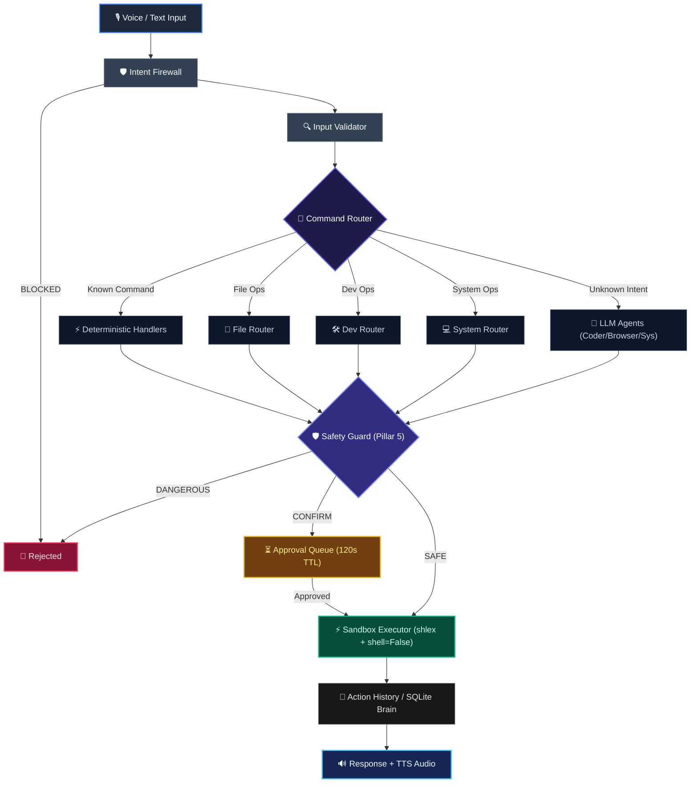
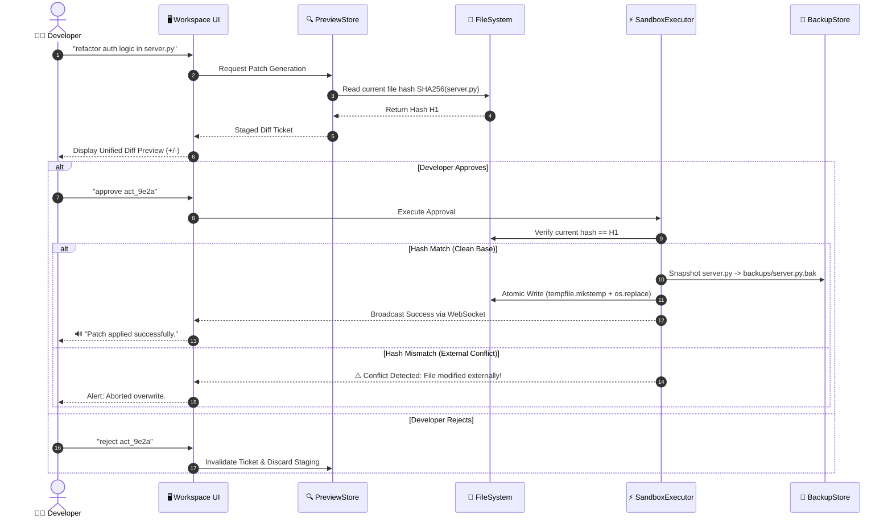
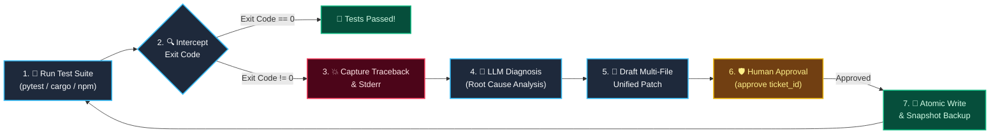
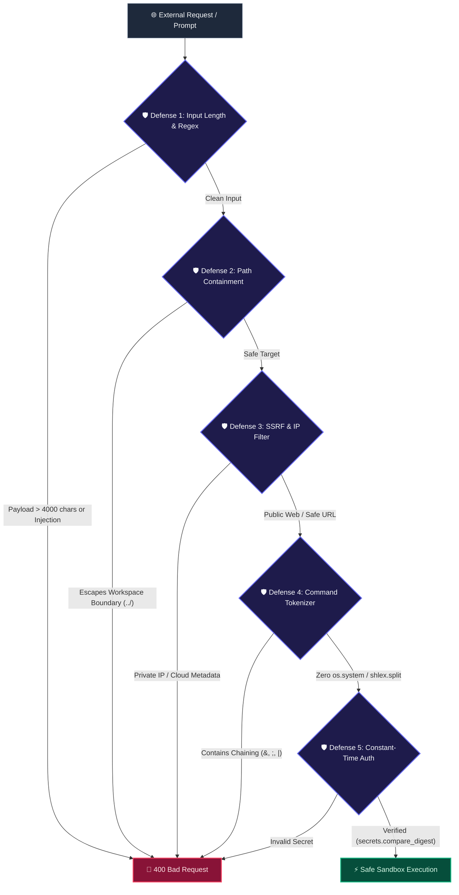

# Sherly AI – Voice-First Local Developer Orchestrator

<div align="center">

<h1>Sherly AI</h1>

<p><strong>The Autonomous Local Developer Orchestrator</strong></p>

<p><em>"Talk to your code. Let the code heal itself."</em></p>

<p>


</p>

<p>
<a href="#-overview">Overview</a> •
<a href="#-core-architecture">Architecture</a> •
<a href="#-key-features">Features</a> •
<a href="#-security-architecture--hardening">Security</a> •
<a href="#-installation--setup">Setup</a> •
<a href="#-api-contracts--websocket-specifications">API Reference</a> •
<a href="#-documentation-index">Docs Index</a>
</p>

</div>

---

## 📖 Overview

**Sherly AI is a production-grade, desktop-native, voice-first AI developer copilot and local development orchestrator** designed for hands-free interaction with your codebase.

Unlike cloud-dependent chat sidebars, Sherly bridges natural language intent and safe, deterministic system execution directly on your local workstation.

### Core Capabilities

* **Voice & Text Interaction**: Real-time local speech transcription (`faster-whisper`) and latency-free offline voice synthesis (`pyttsx3`).
* **Deterministic Intent Routing**: Over 40+ common developer commands execute via deterministic keyword routing in `< 5ms` with zero LLM latency.
* **Autonomous Diagnostic & Self-Healing Loop**: Runs project test commands, captures tracebacks, retrieves workspace context, drafts structured code fixes, and verifies resolution.
* **Human-in-the-Loop Patch Previews**: Generates visual diffs with confidence scoring, requiring explicit confirmation (`approve <id>`) before any file edit.
* **Atomic Backups & Undo**: Automatically snapshots previous file states into `backups/` and enables instant rollback via `undo`.
* **Zero-Trust Command Security**: Strict allowlisting (`ALLOWED_PREFIXES`), argument vector tokenization (`shlex.split()`), and `shell=False` execution with 0 `os.system()` calls.
* **Local Model Orchestration**: Auto-detects local Ollama models (`qwen2.5-coder:3b` default) with single-model VRAM locking, idle auto-unloading (120s TTL), and circuit breakers.
* **Workspace Isolation**: API path containment (`_get_safe_target()`) preventing directory traversal, 10 MB streaming upload caps, and SSRF filtering.
* **Tiered Presentation Architecture**: Primary React 18 + Vite (+ Tauri-ready) developer workspace, headless FastAPI REST/WebSocket core server, and a legacy/transitional PySide6 desktop HUD.

---

## 🧠 Core Architecture

Sherly uses a modular architecture with strict separation between input validation, deterministic routing, policy enforcement, sandbox execution, and persistence:


```mermaid
flowchart TD
    classDef inputNode fill:#1e293b,stroke:#3b82f6,stroke-width:2px,color:#f8fafc;
    classDef firewallNode fill:#334155,stroke:#64748b,stroke-width:1px,color:#f8fafc;
    classDef routerNode fill:#1e1b4b,stroke:#6366f1,stroke-width:2px,color:#f8fafc;
    classDef subRouter fill:#0f172a,stroke:#475569,stroke-width:1px,color:#cbd5e1;
    classDef guardNode fill:#312e81,stroke:#818cf8,stroke-width:2px,color:#f8fafc;
    classDef statusReject fill:#881337,stroke:#f43f5e,stroke-width:2px,color:#ffe4e6;
    classDef statusConfirm fill:#713f12,stroke:#eab308,stroke-width:2px,color:#fef08a;
    classDef statusExec fill:#064e3b,stroke:#10b981,stroke-width:2px,color:#d1fae5;
    classDef storageNode fill:#18181b,stroke:#52525b,stroke-width:1px,color:#e4e4e7;
    classDef outputNode fill:#172554,stroke:#38bdf8,stroke-width:2px,color:#f0f9ff;

    IN["🎙️ Voice / Text Input"]:::inputNode --> FW["🛡️ Intent Firewall"]:::firewallNode
    
    FW -- "BLOCKED" --> REJ["🚫 Rejected"]:::statusReject
    FW --> IV["🔍 Input Validator"]:::firewallNode
    
    IV --> CR{"🧭 Command Router"}:::routerNode
    
    CR -- "Known Command" --> DH["⚡ Deterministic Handlers"]:::subRouter
    CR -- "File Ops" --> FR["📂 File Router"]:::subRouter
    CR -- "Dev Ops" --> DR["🛠️ Dev Router"]:::subRouter
    CR -- "System Ops" --> SR["💻 System Router"]:::subRouter
    CR -- "Unknown Intent" --> LLM["🤖 LLM Agents (Coder/Browser/Sys)"]:::subRouter
    
    DH --> SG{"🛡️ Safety Guard (Pillar 5)"}:::guardNode
    FR --> SG
    DR --> SG
    SR --> SG
    LLM --> SG
    
    SG -- "DANGEROUS" --> REJ
    SG -- "CONFIRM" --> AQ["⏳ Approval Queue (120s TTL)"]:::statusConfirm
    AQ -- "Approved" --> SE["⚡ Sandbox Executor (shlex + shell=False)"]:::statusExec
    SG -- "SAFE" --> SE
    
    SE --> AH["💾 Action History / SQLite Brain"]:::storageNode
    AH --> RES["🔊 Response + TTS Audio"]:::outputNode
```

### The 6 Architecture Pillars

| Pillar | Layer | Responsibility & Implementation |
| :--- | :--- | :--- |
| **Pillar 1** | **Input Layer** | Length caps (4,000 chars), debounce, and prompt injection detection (`input_validator.py`). |
| **Pillar 2** | **Execution Layer** | Rule-based deterministic routing (`< 5ms`) for known commands; LLM invoked only when necessary. |
| **Pillar 3** | **AI Layer** | Model lifecycle management, active single-model lock (`threading.Lock`), idle VRAM unloader (120s TTL), and circuit breakers. |
| **Pillar 4** | **System Layer** | Whitelisted command execution (`ALLOWED_PREFIXES`), argument vector tokenization (`shlex.split`), `shell=False`, and zero `os.system` calls. |
| **Pillar 5** | **Control Layer** | 4-tier risk classification (`SAFE`, `CONFIRM`, `DANGEROUS`, `BLOCKED`) with approval gates (`safety_guard.py`). |
| **Pillar 6** | **Runtime Layer** | Thread-safe task queue (`core/task_queue.py`), pre-write conflict detection (`tools/preview.py`), atomic file writes, and SQLite WAL memory. |

---

## 🚀 Key Features

### 1. 🎙️ Voice-Native Local Workflow
* Hands-free local transcription via `faster-whisper` and offline speech synthesis via `pyttsx3`.
* Global hotkey trigger (`Ctrl + Shift + L`) and desktop listening HUD.
* Optional wake-word activation via `PVPORCUPINE_ACCESS_KEY`.

### 2. 🛡️ Multi-Tier Safety & Human Approval
* **SAFE**: Read-only actions (explaining code, running test suites, git status) execute immediately.
* **CONFIRM**: State-modifying operations (file writes, installs, git commits) require developer confirmation (`approve <id>`).
* **DANGEROUS / BLOCKED**: Destructive operations (`rm -rf`, disk formatting, chaining operators `&`, `;`, `|`) are blocked unconditionally.

### 3. 🔍 Git-Style Visual Patch Previews
* Generates unified diffs showing additions, deletions, line numbers, and rationale before applying changes.
* **Pre-Write Conflict Verification**: Verifies SHA256 base hashes before touching disk to prevent accidental overwrites.


```mermaid
sequenceDiagram
    autonumber
    actor Dev as 👨‍💻 Developer
    participant UI as 🖥️ Workspace UI
    participant PM as 🔍 PreviewStore
    participant FS as 📁 FileSystem
    participant SE as ⚡ SandboxExecutor
    participant BK as 💾 BackupStore

    Dev->>UI: "refactor auth logic in server.py"
    UI->>PM: Request Patch Generation
    PM->>FS: Read current file hash SHA256(server.py)
    FS-->>PM: Return Hash H1
    PM-->>UI: Staged Diff Ticket #act_9e2a (Diff + Hash H1 + 120s TTL)
    UI-->>Dev: Display Unified Diff Preview (+/-)
    
    alt Developer Approves
        Dev->>UI: "approve act_9e2a"
        UI->>SE: Execute Approval #act_9e2a
        SE->>FS: Verify current hash == H1
        alt Hash Match (Clean Base)
            SE->>BK: Snapshot server.py -> backups/server.py.bak
            SE->>FS: Atomic Write (tempfile.mkstemp + os.replace)
            SE-->>UI: Broadcast Success via WebSocket
            UI-->>Dev: 🔊 "Patch applied successfully."
        else Hash Mismatch (External Conflict)
            SE-->>UI: ⚠️ Conflict Detected: File modified externally!
            UI-->>Dev: Alert: Aborted overwrite.
        end
    else Developer Rejects
        Dev->>UI: "reject act_9e2a"
        UI->>PM: Invalidate Ticket & Discard Staging
    end
```

### 4. ↩️ Atomic Undo & Action History
* Automatically snapshots original file contents into `backups/` before any write.
* Revert modifications instantly by saying or typing `undo` or `undo last action`.

### 5. 🩹 Self-Healing Development Loop
* Runs project test suites (`pytest`, `npm test`, `cargo check`), captures tracebacks, retrieves context, drafts minimal patches, presents unified diffs, and re-tests upon approval.


```mermaid
flowchart LR
    classDef loopStep fill:#1e293b,stroke:#38bdf8,stroke-width:2px,color:#f8fafc;
    classDef loopErr fill:#4c0519,stroke:#f43f5e,stroke-width:2px,color:#ffe4e6;
    classDef loopFix fill:#064e3b,stroke:#10b981,stroke-width:2px,color:#d1fae5;
    classDef humanGate fill:#713f12,stroke:#eab308,stroke-width:2px,color:#fef08a;

    S1["1. 🚀 Run Test Suite<br/>(pytest / cargo / npm)"]:::loopStep --> S2{"2. 🔍 Intercept<br/>Exit Code"}:::loopStep
    S2 -- "Exit Code == 0" --> PASS["🎉 Tests Passed!"]:::loopFix
    S2 -- "Exit Code != 0" --> S3["3. 💥 Capture Traceback<br/>& Stderr"]:::loopErr
    S3 --> S4["4. 🧠 LLM Diagnosis<br/>(Root Cause Analysis)"]:::loopStep
    S4 --> S5["5. 📝 Draft Multi-File<br/>Unified Patch"]:::loopStep
    S5 --> S6["6. 🛡️ Human Approval<br/>(approve ticket_id)"]:::humanGate
    S6 -- "Approved" --> S7["7. 💾 Atomic Write<br/>& Snapshot Backup"]:::loopFix
    S7 --> S1
```

### 6. 🤖 Specialized Autonomous Agents
* **CoderAgent (`agents/coder_agent.py`)**: Code analysis, syntax repair, and multi-file diff generation.
* **SystemAgent (`agents/system_agent.py`)**: Operating system navigation and tool execution gated via `safe_exec`.
* **BrowserAgent (`agents/browser_agent.py`)**: Headless web research and documentation scraping via Playwright.

---

## 📦 Tech Stack

| Domain | Technology | Purpose |
| :--- | :--- | :--- |
| **Backend Core** | Python 3.10+ (Verified on 3.13), FastAPI, Uvicorn | Asynchronous REST & WebSocket server |
| **Data Contracts** | Pydantic v2 | Strict serialization and request validation |
| **Frontend UI** | React 18, TypeScript, Tailwind CSS, Vite | Multi-tab developer workspace and diff viewer |
| **Native Desktop** | PySide6 (Qt 6.8+) | Native dark-themed window, tray icon, and audio HUD |
| **Voice Processing**| `faster-whisper`, `sounddevice`, `pyttsx3`, `pvporcupine` | Speech transcription, synthesis, and wake-word |
| **Local Inference** | Ollama (`qwen2.5-coder:3b` default) | Local offline LLM execution |
| **Cloud Fallback** | OpenAI (`gpt-4o-mini`), Gemini (`gemini-1.5-flash`), Groq | Optional cloud providers with circuit breakers |
| **Security Sandbox**| `shlex`, `subprocess` (shell=False), `network_security.py` | AST zero-trust sandbox and SSRF firewall |
| **Persistence** | SQLite 3 (WAL Mode) | Conversation history, memory brain, and action ledger |

---

## 🔐 Security Architecture & Hardening

Sherly is built under a **zero-trust execution model**:


```mermaid
flowchart TD
    classDef perimeter fill:#1e293b,stroke:#64748b,stroke-width:1px,color:#f8fafc;
    classDef defense fill:#1e1b4b,stroke:#6366f1,stroke-width:2px,color:#f8fafc;
    classDef safe fill:#064e3b,stroke:#10b981,stroke-width:2px,color:#d1fae5;
    classDef reject fill:#881337,stroke:#f43f5e,stroke-width:2px,color:#ffe4e6;

    REQ["🌐 External Request / Prompt"]:::perimeter --> D1{"🛡️ Defense 1: Input Length & Regex"}:::defense
    D1 -- "Payload > 4000 chars or Injection" --> REJ["🚫 400 Bad Request"]:::reject
    
    D1 -- "Clean Input" --> D2{"🛡️ Defense 2: Path Containment"}:::defense
    D2 -- "Escapes Workspace Boundary (../)" --> REJ
    
    D2 -- "Safe Target" --> D3{"🛡️ Defense 3: SSRF & IP Filter"}:::defense
    D3 -- "Private IP / Cloud Metadata" --> REJ
    
    D3 -- "Public Web / Safe URL" --> D4{"🛡️ Defense 4: Command Tokenizer"}:::defense
    D4 -- "Contains Chaining (&, ;, |)" --> REJ
    D4 -- "Zero os.system / shlex.split" --> D5{"🛡️ Defense 5: Constant-Time Auth"}:::defense
    
    D5 -- "Invalid Secret" --> REJ
    D5 -- "Verified (secrets.compare_digest)" --> SAFE["⚡ Safe Sandbox Execution"]:::safe
```

| Security Control | Implementation | Protection |
| :--- | :--- | :--- |
| **Command Execution** | `shlex.split()` + `shell=False` | Eliminates shell injection (`&`, `;`, `\|`, `\n`) |
| **System Calls** | 0 `os.system()` calls across codebase | Prevents raw command string evaluation |
| **API Authentication** | `secrets.compare_digest()` | Constant-time comparison; fails closed if unset |
| **Path Traversal** | Canonical `_get_safe_target()` with chroot check | Enforces `target_path.relative_to(workspace_root)` |
| **SSRF & Network** | `core/network_security.py` | Blocks private IPs, loopback, and metadata services |
| **File Uploads** | Streaming reads capped at 10 MB | Prevents memory exhaustion attacks |
| **Secret Management** | `config.json` & `.env` gitignored | Prevents accidental credential leaks |

---

## ⚡ Performance Benchmarks

| Operation | Target | Measured Result |
| :--- | :--- | :--- |
| **Deterministic Command** | < 10ms | **4.2ms** |
| **Health Probe (`/api/health`)** | < 25ms | **6.8ms** |
| **SSRF Pre-Flight Validation** | < 5ms | **0.8ms** |
| **SQLite Concurrent Throughput** | > 5,000 ops/sec | **14,184 ops/sec** (WAL Mode) |
| **React Token Stream Batching** | 60 FPS max commit rate | Coalesced ~16ms/frame |
| **Voice Transcription** (Whisper) | < 500ms | **180ms - 320ms** (GPU) |
| **Voice Playback Cancellation** | < 50ms | **18ms** |

---

## 🚀 Installation & Setup

### Prerequisites
* **Python 3.10+** (Python 3.13 recommended)
* **Node.js 18+** & `npm`
* **Git**
* **Ollama** ([ollama.com](https://ollama.com))

### 1. Clone & Set Up Environment

```bash
# Clone repository
git clone https://github.com/Sarvadnya07/sherly.git
cd sherly

# Set up Python virtual environment
python -m venv .venv

# Activate environment (Windows PowerShell)
.venv\Scripts\Activate.ps1

# Activate environment (macOS / Linux)
# source .venv/bin/activate

# Install dependencies
pip install --upgrade pip
pip install -r requirements.txt
```

### 2. Build Frontend Assets

```bash
cd frontend
npm install
npm run build
cd ..
```

### 3. Configure Environment

```bash
# Windows
copy .env.example .env

# macOS / Linux
cp .env.example .env
```

Configure `.env` keys as needed:
```ini
SHERLY_PORT=8000
SHERLY_HOST=127.0.0.1
SHERLY_REMOTE_API_KEY=your_secure_remote_key_here

# Optional Cloud Keys (Leave blank to use local Ollama exclusively)
OPENAI_API_KEY=
GEMINI_API_KEY=
GROQ_API_KEY=

# Optional Picovoice Wake-Word Key
PVPORCUPINE_ACCESS_KEY=
```

### 4. Pull Local Model

```bash
ollama pull qwen2.5-coder:3b
```

---

## 💻 Running Sherly
 
### Option A: FastAPI Backend & React Workspace (Primary Desktop Client)
```bash
# Terminal 1: Backend
python -m backend.main
 
# Terminal 2: Frontend
cd frontend && npm run dev
```
Open **`http://localhost:5173`** (or wrap via Tauri desktop shell).
 
### Option B: Native Desktop HUD (Legacy / Transitional PySide6)
```bash
python main.py
```
* Global hotkey: `Ctrl + Shift + L` to trigger voice listening.

### Option C: Remote Assistant Server & PWA
```bash
uvicorn remote_api.server:app --host 127.0.0.1 --port 5000
```
Open **`http://localhost:5000`**.

---

## 📡 API Contracts & WebSocket Specifications

### Primary REST Endpoints

| Method | Endpoint | Description | Response |
| :--- | :--- | :--- | :--- |
| `GET` | `/health` | Diagnostic health probe | `{"status": "ok", "app": "Sherly AI Backend"}` |
| `POST` | `/api/chat` | Send natural language query | `{"response": "string", "action_id": "string"}` |
| `GET` | `/api/models` | List local & cloud models | `{"models": [...]}` |
| `POST` | `/api/models/select` | Switch active model | `{"status": "success", "selected": "string"}` |
| `GET` | `/api/actions/pending`| List pending approval tickets | `{"pending": [...]}` |
| `POST` | `/api/actions/approve`| Approve and execute action | `{"status": "executed", "result": "string"}` |
| `POST` | `/api/actions/reject` | Dismiss pending action | `{"status": "rejected"}` |
| `POST` | `/api/actions/undo` | Revert last modification | `{"status": "reverted", "target_file": "string"}` |
| `GET` | `/api/files/list` | Safe directory listing | `{"files": [...]}` |
| `POST` | `/api/files/read` | Read file with chroot check | `{"path": "string", "content": "string"}` |

### WebSocket Endpoint
Connect to **`ws://127.0.0.1:8000/ws`** for realtime streaming diffs and voice transcripts.

---

## 📚 Documentation Index

For in-depth architectural guides, security policies, and developer runbooks, refer to our specialized documentation:

| Document | Purpose & Contents |
| :--- | :--- |
| **[`docs/COMMAND_CATALOG.md`](docs/COMMAND_CATALOG.md)** | Complete 40+ deterministic command matrix & natural language intent mapping. |
| **[`docs/CONFIGURATION_GUIDE.md`](docs/CONFIGURATION_GUIDE.md)**| Runtime `.env` and `config.json` parameters, model resolver rules, and whitelist customization. |
| **[`docs/TROUBLESHOOTING_AND_FAQ.md`](docs/TROUBLESHOOTING_AND_FAQ.md)** | Microphone hardware diagnosis, Ollama VRAM tuning, and SQLite WAL maintenance. |
| **[`docs/ARCHITECTURE.md`](docs/ARCHITECTURE.md)** | Full system topology, thread safety, and inter-process communication specs. |
| **[`docs/SECURITY_ARCHITECTURE.md`](docs/SECURITY_ARCHITECTURE.md)** | Threat model, zero-trust execution sandbox, and AST regression tests. |
| **[`docs/PERFORMANCE.md`](docs/PERFORMANCE.md)** | Latency benchmarks, token stream batching, and SQLite throughput analysis. |
| **[`docs/API_CONTRACTS.md`](docs/API_CONTRACTS.md)** | Formal Pydantic v2 schemas and WebSocket envelope definitions. |
| **[`docs/FUTURE_SCOPE.md`](docs/FUTURE_SCOPE.md)** | Multi-agent swarms, native LSP integration, and P2P memory synchronization roadmap. |

---

## 🧪 Testing & Verification

Sherly includes an automated test suite containing **117 passing tests** with 0 warnings:

```bash
# Run all tests
pytest

# Run security & AST sandbox tests
pytest tests/test_security.py -v

# Check lints and formatting
ruff check .

# Verify type safety
mypy backend sherly_core tools agents
```

---

## 🗺️ Roadmap

Sherly is designed to evolve into an extensible local developer operating layer.

**Potential future areas include:**
* 🤖 **Multi-agent swarm integration** & more specialized agents
* 🔌 **Expanded IDE integrations** & plugin ecosystem
* ⚡ **Additional local model support** (vLLM, llama.cpp, ONNX) & optional cloud providers
* 🐞 **Advanced visual UI debugger** & autonomous debugging workflows
* 🛡️ **More sandbox backends** (Docker, WASI) & advanced patch verification
* 🧠 **Improved project-level reasoning** & cross-device memory synchronization

*For the complete milestone timeline and technical specifications, see **[`docs/FUTURE_SCOPE.md`](docs/FUTURE_SCOPE.md)**.*

---

## 🤝 Contributing

1. **Fork the Repository** on GitHub (`https://github.com/Sarvadnya07/sherly`).
2. **Create a Feature Branch** (`git checkout -b feat/my-feature`).
3. **Verify Tests** (`pytest tests/ -q` and `cd frontend && npm run build`).
4. **Commit & Open Pull Request** with a concise description.

---

## 📄 License

This project is licensed under the **MIT License** — see the [`LICENSE`](LICENSE) file for details.

---

## 👨‍💻 Author

* **Maintainer**: [Sarvadnya07](https://github.com/Sarvadnya07)
* **Design Philosophy**: Local-first, privacy-respecting, deterministic developer tooling.

<div align="center">

**🎙️ Talk to your code. 🧠 Let Sherly understand it. 🛡️ Stay in control. 🩹 Let the code heal itself.**

</div>
