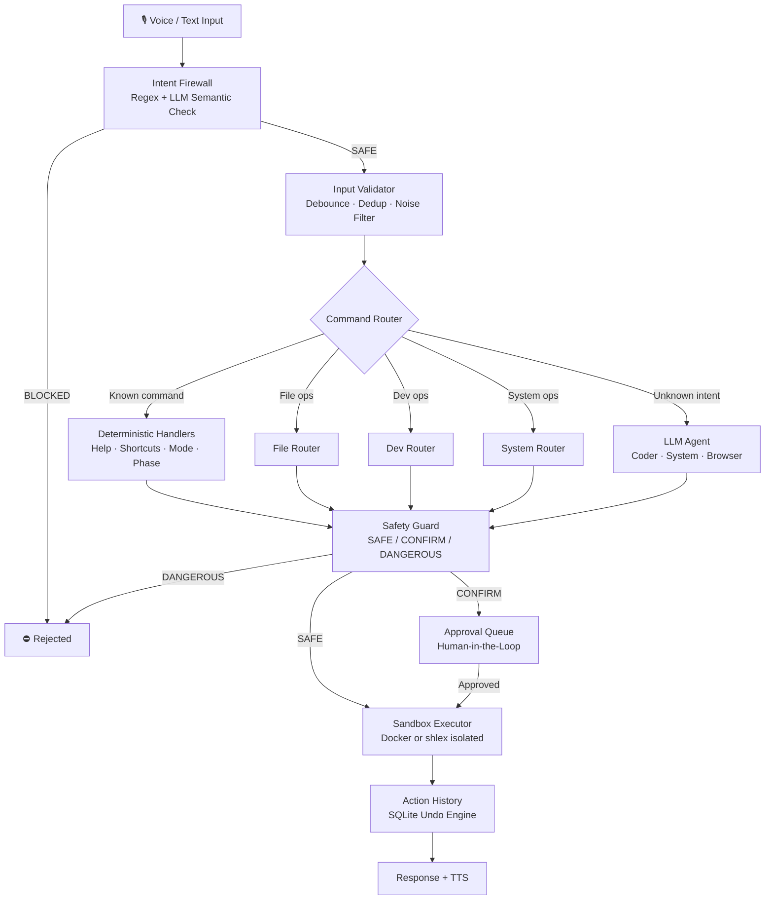

<div align="center">
  
  <h1>Sherly AI</h1>
  <p><strong>The Autonomous Local Developer Orchestrator</strong></p>
  <p><em>"Talk to your code. Let the code heal itself."</em></p>

  [](https://opensource.org/licenses/MIT)
  [](https://www.python.org/downloads/)
  [](https://github.com/Sarvadnya07/sherly/actions)
  [](#testing)
  [](#security--safety)
  [](#persistent-project-memory)

</div>

---

## Overview

Sherly is a **desktop-native, voice-first AI orchestrator** built for developers who want true hands-free automation. It goes far beyond a chatbot — Sherly listens to your intent, classifies the risk of every action through a multi-tier safety firewall, and executes against your local environment through hardened, isolated tooling.

The core philosophy: **deterministic safety first, LLM as a last resort.** Known commands are handled by a rule-based router before any AI model is ever called, ensuring sub-100ms responses for common workflows and predictable, auditable behavior.

**Supports**: Windows · macOS · Linux

---

## Features

### 🎙️ Voice-Native Execution
Sub-second speech-to-text powered by `faster-whisper`. Sherly activates on a global hotkey (`Ctrl+Shift+S`) and transcribes your intent without cloud dependency.

### 🛡️ Multi-Tier Intent Firewall
Every input passes through a **3-layer security stack** before any action is taken:
1. **Regex blacklist** — blocks known injection patterns immediately.
2. **LLM semantic firewall** — detects advanced jailbreak attempts that bypass simple regex.
3. **Command safety classifier** — categorizes every shell command as `SAFE / CONFIRM / DANGEROUS` with unconditional blocking for destructive patterns.

### 🩹 Autonomous Self-Healing
When a command or script fails, Sherly captures the full traceback, performs a **RAG-based context lookup** against your codebase, and proposes an LLM-generated fix — all without leaving your terminal.

### 🧠 Persistent Project Memory (RAG)
A local **ChromaDB** vector store indexes your entire codebase in parallel (using `ThreadPoolExecutor`). Queries are answered with semantic search + optional LLM summarization, with zero re-indexing penalty between sessions.

### ↩️ Atomic Undo Engine
Every file write and deletion is tracked in a **SQLite-backed action history**. `write_file_safe()` and `delete_file_safe()` preserve pre-change content as backup before acting. Say "undo" to revert instantly.

### 🤖 Multi-Agent Orchestration
A `CoderAgent`, `SystemAgent`, and `BrowserAgent` (Playwright-backed) are coordinated by a central `AgentOrchestrator`. Complex objectives are broken down into typed sub-tasks via structured LLM planning, then dispatched to the appropriate specialist.

### 🌐 Encrypted P2P Sync
Synchronize memory and configuration across machines on the same network via **UDP broadcast discovery + AES-encrypted packets**. No cloud, no central server.

### 🧩 Plugin Architecture
A hot-loadable plugin system with per-plugin enable/disable controls, a `PluginSDK` base class, and lazy tool registration via `ToolRegistry`. Add new capabilities without touching the core codebase.

### 👻 Ghost Mode (IDE Integration)
Run Sherly as a headless socket server (port `5555`) and receive responses directly in your IDE terminal — zero UI required.

### 🔄 Multi-Model Backend
Hot-swap between **Ollama (local)**, **OpenAI**, **Gemini**, and **Groq** at runtime. The model manager enforces a single active model lock, a 5-minute idle unload TTL, and a circuit breaker (`fail_max=3`) to prevent cascading failures.

---

## Tech Stack

| Layer | Technology |
| :--- | :--- |
| **UI** | PySide6 (Qt6), Glassmorphism overlay, System Tray |
| **Voice I/O** | `faster-whisper` (STT), `pyttsx3` (TTS) |
| **LLM Backends** | Ollama (local), OpenAI GPT-4o-mini, Gemini 1.5 Flash, Groq Llama3 |
| **Vector Memory** | ChromaDB (persistent local) |
| **Browser Automation** | Playwright |
| **Sandbox** | Docker + `shlex` + `shell=False` |
| **Persistence** | SQLite (action history, conversation memory) |
| **Encryption** | `cryptography` (AES via `StorageEncryption`) |
| **Resilience** | `tenacity` (retry), custom circuit breaker, `ThreadPoolExecutor` |
| **Web Search** | `duckduckgo-search` |
| **CI** | GitHub Actions (Python 3.10, 3.11, 3.12 matrix) |

---

## Architecture

Sherly uses a **Modular Sub-Router Architecture** with a **Dependency Injection (DI)** container, ensuring clean separation between input handling, safety enforcement, routing, and execution.


```mermaid
graph TD
    A[🎙️ Voice / Text Input] --> B[Intent Firewall\nRegex + LLM Semantic Check]
    B -->|SAFE| C[Input Validator\nDebounce · Dedup · Noise Filter]
    B -->|BLOCKED| X[⛔ Rejected]
    C --> D{Command Router}
    D -->|Known command| E[Deterministic Handlers\nHelp · Shortcuts · Mode · Phase]
    D -->|File ops| F[File Router]
    D -->|Dev ops| G[Dev Router]
    D -->|System ops| H[System Router]
    D -->|Unknown intent| I[LLM Agent\nCoder · System · Browser]
    E & F & G & H & I --> J[Safety Guard\nSAFE / CONFIRM / DANGEROUS]
    J -->|SAFE| K[Sandbox Executor\nDocker or shlex isolated]
    J -->|CONFIRM| L[Approval Queue\nHuman-in-the-Loop]
    J -->|DANGEROUS| X
    K --> M[Action History\nSQLite Undo Engine]
    L -->|Approved| K
    M --> N[Response + TTS]
```

---

## Installation

### Prerequisites

- Python 3.10+
- [Ollama](https://ollama.com/) — for local LLM inference (`phi3` or `llama3` recommended)
- [Docker Desktop](https://www.docker.com/products/docker-desktop/) — for the hardened sandbox (optional but recommended)
- Git

### Steps

```powershell
# 1. Clone the repository
git clone https://github.com/Sarvadnya07/sherly.git
cd sherly

# 2. Install the package in editable mode
pip install -e .

# 3. Configure environment
copy .env.example .env
# Open .env and add your API keys (leave blank to use local Ollama)

# 4. Pull a local model via Ollama (recommended default)
ollama pull phi3

# 5. Launch Sherly
python src/sherly/main.py
```

For the Docker sandbox (optional, adds an extra security layer):
```powershell
docker build -f Dockerfile.sandbox -t sherly_sandbox_img .
```

---

## Usage

### Voice Commands

Sherly responds to natural speech. Activate listening with `Ctrl+Shift+S` or the UI microphone button:

```
"Sherly, scan this project and tell me what it does."
"Sherly, fix the last error in my terminal."
"Sherly, open VSCode."
"Sherly, run the tests."
"Sherly, explain the file config_manager.py."
"Sherly, switch to Gemini model."
"Sherly, undo."
```

### Text Input

All commands also work via the text input field in the UI.

### Modes

| Mode | Command | Behavior |
| :--- | :--- | :--- |
| **Fast** (default) | `fast mode` | 1–2 sentence responses, optimized for speed |
| **Deep** | `deep mode` | 4–6 structured sentences with reasoning |
| **Dev** | `dev mode` | Technical, command-level, code-precise output |

### Phases

Sherly ships with a progressive feature unlocking system:

| Phase | Features |
| :--- | :--- |
| **A** | Core command routing, safety guard, deterministic shortcuts |
| **B** | LLM planning (`think()`), clarification questions |
| **C** | Feedback loop (y/n rating), RLHF data logging |

Switch phases with: `"set phase B"` — persisted across sessions via `memory_brain`.

### Ghost Mode

Run Sherly headless (no UI) as a socket server:
```powershell
python src/sherly/core/ghost_mode.py
# Send JSON commands to port 5555
```

---

## Configuration

### Environment Variables (`.env`)

```ini
OPENAI_API_KEY=sk-...       # Optional: use OpenAI GPT-4o-mini
GEMINI_API_KEY=AIza...      # Optional: use Google Gemini 1.5 Flash
GROQ_API_KEY=gsk_...        # Optional: use Groq Llama3-70B
```

### `src/sherly/config/config.json` (auto-generated on first run)

```json
{
    "current_model": "phi3",
    "auto_mode": false,
    "api_keys": {
        "openai": "YOUR_OPENAI_KEY",
        "gemini": "YOUR_GEMINI_KEY",
        "groq": "YOUR_GROQ_KEY"
    },
    "plugins": {},
    "db_config": {
        "provider": "sqlite",
        "url": "sherly_history.db"
    },
    "chroma_config": {
        "mode": "local",
        "host": "localhost",
        "port": 8000
    }
}
```

Switch models at runtime: `"switch to gemini model"` — no restart needed.

---

## Folder Structure

```
sherly/
├── .env.example                    # Environment variable template
├── .github/
│   └── workflows/main.yml          # CI: Python 3.10 / 3.11 / 3.12 matrix
├── Dockerfile.sandbox              # Hardened Docker sandbox image
├── pyproject.toml                  # Package config & dependency declaration
├── docs/
│   ├── GUIDE.md                    # Full user guide
│   ├── FUTURE_SCOPE.md             # Strategic roadmap
│   ├── STABILITY_REPORT.md         # Bug status & QA audit
│   └── PRODUCTION_AUDIT.md         # Security & performance audit
├── tests/                          # Pytest integration & unit suite
│   ├── test_action_manager.py
│   ├── test_classify_action.py
│   ├── test_input_validator.py
│   ├── test_integration_orchestrator.py
│   ├── test_model_manager_failures.py
│   └── test_runtime_utils.py
└── src/
    └── sherly/
        ├── main.py                 # Entry point (pre-flight checks + Qt launch)
        ├── agents/                 # Specialized LLM agents
        │   ├── base_agent.py       # Abstract lifecycle base class
        │   ├── coder_agent.py
        │   ├── system_agent.py
        │   ├── browser_agent.py    # Playwright-backed web agent
        │   └── playwright_agent.py
        ├── config/
        │   └── config_manager.py   # JSON + env-var config layer
        ├── core/                   # Security, orchestration, infrastructure
        │   ├── orchestrator.py     # Multi-agent task planner & dispatcher
        │   ├── safety_guard.py     # 3-tier command classifier (SAFE/CONFIRM/DANGEROUS)
        │   ├── input_validator.py  # Injection firewall, debounce, dedup
        │   ├── task_queue.py       # Thread-safe background worker queue
        │   ├── memory_rag.py       # ChromaDB vector store + threaded indexer
        │   ├── sandbox.py          # Docker + shlex isolated executor
        │   ├── p2p_sync.py         # Encrypted UDP peer-to-peer sync
        │   ├── plugin_manager.py   # Hot-loadable plugin registry
        │   ├── ghost_mode.py       # Headless socket server (IDE integration)
        │   ├── biometrics.py       # Windows Hello / biometric approval (POC)
        │   ├── encryption.py       # AES storage encryption
        │   ├── sanitizer.py        # Entropy-based log secret redaction
        │   └── ...                 # (diagnostics, optimizer, federated, wasm_sandbox)
        ├── routers/                # Domain-specific command sub-routers
        │   ├── dev_router.py       # Error analysis, fix, project ops
        │   ├── file_router.py      # File explain, scan
        │   └── system_router.py    # Diagnostics, model switching
        ├── services/               # Core application services
        │   ├── command_router.py   # Central routing logic (Pillar entry point)
        │   ├── action_manager.py   # Approval queue + Undo engine (SQLite)
        │   ├── model_manager.py    # Multi-provider LLM abstraction + circuit breaker
        │   ├── agent_manager.py    # Agent dispatch interface
        │   ├── speech_to_text.py   # faster-whisper STT pipeline
        │   ├── text_to_speech.py   # pyttsx3 TTS (+ neural voice infrastructure)
        │   ├── memory_brain.py     # Key-value preference store
        │   ├── conversation_memory.py # Rolling conversation context
        │   └── web_search.py       # DuckDuckGo integration
        ├── tools/                  # Executable tool implementations
        │   ├── ast_tools.py        # Python AST analysis & patching
        │   ├── file_tools.py       # File read/explain
        │   ├── terminal_tools.py   # safe_exec wrapper
        │   ├── screen_tools.py     # Multi-monitor screenshot analysis
        │   ├── fix_project.py      # Self-healing project repair
        │   └── ...
        └── ui/                     # PySide6 desktop interface
            ├── app_manager.py      # Main window & lifecycle manager
            ├── window.py           # Full Qt window implementation
            ├── overlay.py          # Glassmorphism status HUD
            └── tray_icon.py        # System tray integration
```

---

## Security & Safety

Sherly employs defense-in-depth across the entire execution path:

| Layer | Mechanism | Protection |
| :--- | :--- | :--- |
| **Input Validation** | Regex + LLM semantic firewall | Prompt injection, jailbreaks |
| **Command Classification** | Pattern-matched `SAFE/CONFIRM/DANGEROUS` | Destructive shell commands |
| **Subprocess Execution** | `shlex.split()` + `shell=False` | Shell injection via crafted strings |
| **Sandbox Isolation** | Docker container (512MB RAM, 0.5 CPU cap) | Environment corruption |
| **Secret Redaction** | Entropy-based `LogSanitizer` | API key / token leakage in logs |
| **Atomic Writes** | Pre-write backup → `os.replace()` | File corruption on power loss |
| **Model Lock** | Single `threading.Lock()` per model slot | Concurrent RAM/VRAM spikes |

---

## Performance

| Optimization | Implementation |
| :--- | :--- |
| **RAG Indexing** | Parallel `ThreadPoolExecutor` (8 workers) over project files |
| **LLM Timeout** | Hard 15-second `concurrent.futures` timeout per call |
| **VRAM Management** | 5-minute idle TTL → automatic model unload via Ollama API |
| **Circuit Breaker** | Opens after 3 consecutive failures, resets after 30s |
| **Context Window Cap** | Hard limit of last 10 message turns to prevent context drift |
| **Deterministic Routing** | Rule-based COMMAND_MAP checked before any LLM call |
| **Response Capping** | 120 tokens / 500 characters hard cap on all LLM output |
| **Background Tasking** | Single daemon worker thread keeps the UI responsive |

---

## Testing

```powershell
# Run the full test suite
pytest

# With verbose output
pytest -v

# Run a specific test file
pytest tests/test_input_validator.py
```

The CI pipeline runs across **Python 3.10, 3.11, and 3.12** on every push and pull request to `main`.

---

## Contributing

Contributions are welcome. Please read [CONTRIBUTING.md](CONTRIBUTING.md) before opening a PR.

**Key rules:**
1. Fork → branch from `main` → implement → test → `pytest` must pass → PR.
2. Lint with `ruff check .` before submitting.
3. One feature or fix per PR.
4. Update relevant docstrings and `docs/` files for any new tool or router.

---

## License

MIT License — see [LICENSE](LICENSE) for details.

---

## Author

Developed by **[Sarvadnya07](https://github.com/Sarvadnya07)** with a focus on privacy-first, developer-centric AI tooling.

> For detailed usage, see [docs/GUIDE.md](docs/GUIDE.md).
> For known issues and QA status, see [docs/STABILITY_REPORT.md](docs/STABILITY_REPORT.md).
