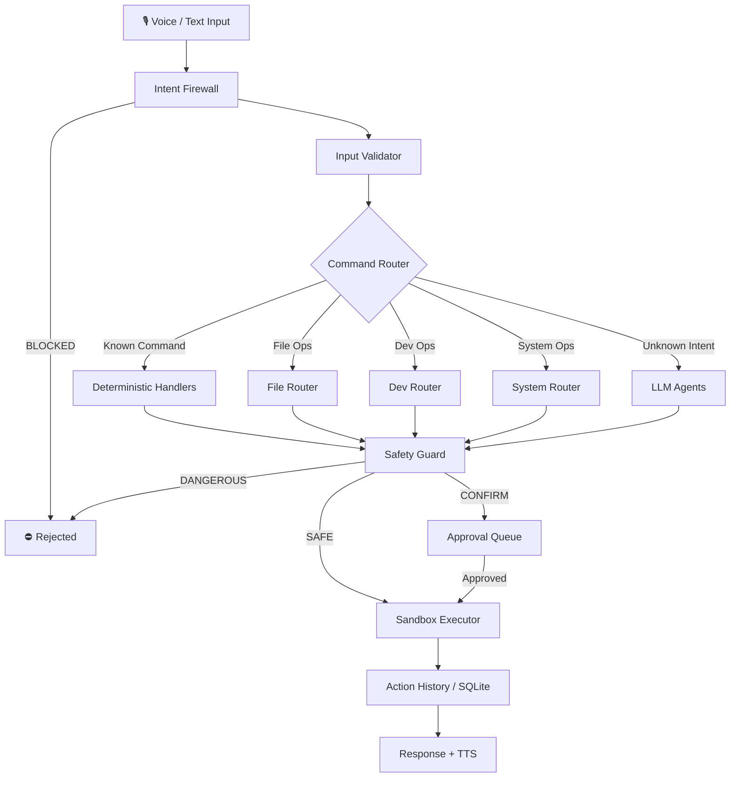

# Sherly AI – Voice-First Local Developer Orchestrator

<div align="center">

<h1>Sherly AI</h1>

<p><strong>The Autonomous Local Developer Orchestrator</strong></p>

<p><em>"Talk to your code. Let the code heal itself."</em></p>

<p>


</p>

</div>

---

## 📖 Overview

**Sherly AI is a production-grade, desktop-native, voice-first AI developer copilot and local development orchestrator** designed for hands-free interaction with your codebase.

Unlike conventional cloud-dependent chat interfaces, Sherly bridges the gap between natural-language intent and safe, deterministic system execution.

Sherly can:

* Listen to voice or text commands with instant `Esc` cancellation
* Understand project-level developer intent across complex workspaces
* Inspect files, parse syntax trees, and scan directory hierarchies
* Execute deterministic development workflows without unnecessary AI latency
* Run tests and development commands through a safe, policy-controlled executor
* Diagnose errors and retrieve relevant project context
* Generate reviewable, multi-file code patches with pre-write conflict validation
* Require explicit human approval for consequential or destructive actions
* Track and undo supported modifications via deterministic pre-state backups
* Maintain persistent local project memory through SQLite
* Auto-resolve local Ollama models (`qwen2.5-coder:3b`) with cloud API fallback
* Coordinate specialized sub-agents for coding, system tasks, and browser automation

Sherly is built around one core principle:

> **Deterministic safety first. LLM as a last resort.**

Known commands are handled through deterministic routing before an AI model is invoked. This keeps common workflows fast, predictable, auditable, and resource-efficient while still allowing local LLM-powered agents to handle complex or ambiguous tasks.

**Supported platforms:**
- **Windows (x86_64)**: Runtime Verified
- **macOS (Apple Silicon / Intel)**: Build Verified (CI)
- **Linux (Ubuntu / Debian)**: Build Verified (CI)

---

## 🎯 Why Sherly Exists

Modern AI coding assistants can introduce several engineering problems:

* Hallucination-driven actions
* Unpredictable command execution
* Excessive dependence on cloud APIs
* Limited visibility into AI-generated changes
* Difficult recovery from unintended modifications
* High local resource consumption
* Weak separation between safe and destructive operations

Sherly was designed to address these problems through:

1. **Local independence** — speech recognition, project indexing, and local LLM inference can run without sending source code to a cloud service.
2. **Deterministic execution** — known workflows bypass unnecessary LLM reasoning.
3. **Human-in-the-loop control** — consequential operations can require explicit approval.
4. **Reversible actions** — file states and action history enable supported operations to be undone.
5. **Patch visibility** — AI-generated modifications are presented as reviewable multi-file patches before application.
6. **Defense in depth** — input validation, semantic security checks, command classification, sandboxing, and secret redaction protect the execution environment.

---

# 🧠 Core Architecture

Sherly is built around **six reliability and safety pillars**.

```text
┌────────────────────────────────────────────────────────────────────────┐
│                        SHERLY UNIFIED DESKTOP                          │
│                                                                        │
│  ┌──────────────────┐  ┌──────────────────┐  ┌──────────────────────┐  │
│  │    Assistant     │  │    Workspace     │  │    Voice Realtime    │  │
│  │ (Chat / Search / │  │(Multi-tab Editor/│  │  (sounddevice STT / │  │
│  │  Tools / Diffs)  │  │  Terminal / Undo)│  │   pyttsx3 TTS / HUD) │  │
│  └────────┬─────────┘  └────────┬─────────┘  └──────────┬───────────┘  │
│           │                     │                       │              │
│           └─────────────────────┼───────────────────────┘              │
│                                 ↓                                      │
│                FastAPI Backend (127.0.0.1:8000)                        │
│                                 ↓                                      │
│        ┌────────────────────────┴────────────────────────┐             │
│        │  ToolRegistry / PolicyEngine / ActionManager    │             │
│        └────────────────────────┬────────────────────────┘             │
│                                 ↓                                      │
│        ┌────────────────────────┴────────────────────────┐             │
│        │    Model Resolver (Local Ollama / Cloud API)    │             │
│        └─────────────────────────────────────────────────┘             │
└────────────────────────────────────────────────────────────────────────┘
```

### 1. Input Layer

Every voice or text request passes through validation and security checks.

* Speech-to-text noise filtering via `faster-whisper`
* Input deduplication and debounce
* Regex-based prompt-injection detection
* Semantic security checks
* Input validation

### 2. Execution Layer

Sherly follows a deterministic-first strategy:

```text
Known command
      ↓
Deterministic handler
```

If deterministic routing cannot confidently handle the request:

```text
Unknown / complex intent
      ↓
Local LLM agent
```

The LLM is therefore reserved for tasks that actually require reasoning.

### 3. AI Layer

The model lifecycle is designed for predictable resource usage.

* Hard LLM call timeouts
* Single active-model locking
* Automatic idle model unloading
* Circuit-breaker protection
* Bounded conversation context
* Multiple model-provider support
* Local Ollama integration (`qwen2.5-coder:3b` default auto-resolution)
* Optional cloud model providers (OpenAI, Gemini, Groq)

### 4. System Layer

Terminal and system execution is restricted through controlled tooling.

* Command classification
* `shlex.split()`
* `shell=False`
* Optional Docker sandboxing
* Destructive-command blocking
* Controlled subprocess execution

### 5. Control Layer

Every consequential action is assigned a safety level:

| Level | Behavior |
| :--- | :--- |
| **SAFE** | Executes directly |
| **CONFIRM** | Requires explicit developer approval |
| **DANGEROUS** | Blocked or requires a higher-level override |
| **BLOCKED** | Always rejected unconditionally |

### 6. Runtime Layer

Sherly protects application stability through:

* Thread-safe background processing
* Task queue protection
* Atomic file writes
* Persistent action history
* Automatic pre-migration backups (`config.json.bak`)
* Secret redaction in logs
* Resilient model execution
* Resource management

---

# 🚀 Key Features

## 🎙️ Voice-Native Development

Sherly is designed for hands-free development.

Use the global hotkey:

```text
Ctrl + Shift + L
```

or use the microphone button in the desktop UI.

Voice commands are processed locally through `faster-whisper` and offline synthesized via `pyttsx3`.

Example commands:

```text
"Sherly, scan this project and tell me what it does."

"Sherly, fix the last error in my terminal."

"Sherly, run the tests."

"Sherly, explain config_manager.py."

"Sherly, open VSCode."

"Sherly, undo."
```

Text input is also supported directly through the desktop interface.

---

# 🛡️ Multi-Tier Safety & Human-in-the-Loop Control

Sherly never blindly executes every request.

The security pipeline is:

```text
Voice / Text
     ↓
Regex Injection Detection
     ↓
Semantic Security Firewall
     ↓
Input Validation
     ↓
Intent / Command Router
     ↓
Safety Classification
     ↓
Execution / Approval / Block
```

The security system combines:

* Regex-based injection detection
* Semantic jailbreak detection
* Command classification
* Shell injection protection
* Sandbox isolation
* Secret redaction
* Approval queues (120s TTL)
* Atomic file operations

## Action Classification

### SAFE

Information retrieval and non-destructive operations.

Examples:

```text
Explain a file
List project files
Inspect configuration
Show project status
Run read-only analysis
```

These can execute immediately.

### CONFIRM

Operations that modify the environment or execute consequential workflows.

Examples:

```text
Write a file
Modify source code
Install a dependency
Execute a development command
Apply a patch
```

These are staged for explicit developer approval.

### DANGEROUS

Destructive or high-risk operations.

Examples include destructive filesystem or shell operations.

These are blocked by default or require a higher-level override.

---

# 🔍 Git-Style Patch Preview & Approval

Before applying an AI-generated code change, Sherly produces a **multi-file patch preview**.

Instead of silently modifying your project, Sherly shows exactly what is proposed.

The preview can include:

* Added lines
* Removed lines
* Modified files
* Confidence score
* Action identifier
* Approval state

Example:

```text
Sherly proposed changes

src/auth.py
  ➕ Added authentication validation
  ➖ Removed insecure fallback

src/config.py
  ➕ Added environment variable handling

Confidence: 87%

Action ID: patch_42
```

The staged patch can then be approved:

```text
approve patch_42
```

Every supported patch can also be backed up before modification.

---

# ↩️ Atomic Undo & Action History

Sherly is designed around reversibility.

Before modifying supported files, Sherly preserves their previous state.

You can undo changes using:

```text
undo
```

or:

```text
undo last action
```

Supported tracked operations can include:

* File modifications
* File restorations
* Previous patches
* Other tracked operations

View previous operations with:

```text
show action history
```

Action history is persisted through SQLite.

---

# 🩹 Self-Healing Development Loop

Sherly can automate the development debugging cycle while keeping the developer in control.

```text
┌───────────┐
│    Run    │ ───→ Execute project build or test suite
└─────┬─────┘
      ↓
┌───────────┐
│  Capture  │ ───→ Collect error output and traceback
└─────┬─────┘
      ↓
┌───────────┐
│  Context  │ ───→ Retrieve relevant project context and source code
└─────┬─────┘
      ↓
┌───────────┐
│  AI Fix   │ ───→ Generate proposed multi-file patch
└─────┬─────┘
      ↓
┌───────────┐
│  Preview  │ ───→ Display colorized visual diff preview
└─────┬─────┘
      ↓
┌───────────┐
│ Approval  │ ───→ Require explicit developer confirmation
└─────┬─────┘
      ↓
┌───────────┐
│   Apply   │ ───→ Apply non-destructive atomic write
└─────┬─────┘
      ↓
   Run Again
      │
      └──────→ If failure → Analyze new error & iterate
```

The workflow is:

1. **Run** — Execute the project or relevant command.
2. **Capture** — Collect the error and traceback.
3. **Understand** — Retrieve relevant project context.
4. **Fix** — Generate a proposed multi-file patch.
5. **Preview** — Show the exact changes.
6. **Approve** — Wait for developer authorization.
7. **Apply** — Safely execute the patch.
8. **Iterate** — If the fix fails, analyze the new error and propose another solution.

This creates a practical **self-healing development workflow without removing the human from the approval loop**.

---

# 🧠 Persistent Project Memory

Sherly includes local SQLite-backed conversation memory and state indexing for persistent project knowledge.

Projects can be indexed into local memory, allowing Sherly to retrieve relevant source files when answering questions or diagnosing failures.

### Benefits

* Project-aware explanations
* Better debugging context
* Semantic source-code search
* Persistent local memory
* Local project indexing
* Parallel indexing with `ThreadPoolExecutor`
* No cloud dependency for project indexing

Example:

```text
User:
"Why is authentication failing?"

Sherly:
1. Searches relevant project context
2. Retrieves authentication-related files
3. Examines the error
4. Connects relevant code paths
5. Explains the failure
6. Can propose a fix
```

---

# 🤖 Multi-Agent Orchestration

Sherly uses specialized agents coordinated by a central `AgentOrchestrator`.

| Agent | Responsibility | Modality & Isolation |
| :--- | :--- | :--- |
| **CoderAgent** | Code analysis, debugging, multi-file fixes, refactoring | AST / Diff Engine |
| **SystemAgent** | System-level operations, test runners, terminal diagnostics | `shlex` / PolicyEngine |
| **BrowserAgent** | Documentation research, web lookups, visual verification | Playwright / Headless |

Complex objectives can be divided into typed subtasks and dispatched to the appropriate specialist.

```text
User Objective
      ↓
AgentOrchestrator
      ↓
┌──────────────┬──────────────┬──────────────┐
│ CoderAgent   │ SystemAgent  │ BrowserAgent │
└──────────────┴──────────────┴──────────────┘
      ↓
Combined Result
```

---

# 🔁 Modular Command Routing

Sherly uses a modular sub-router architecture.

```text
Voice / Text Input
     ↓
Intent Firewall (Prompt Injection & Jailbreak Scans)
     ↓
Input Validator
     ↓
Command Router
     │
     ├── Known Command ────────→ Deterministic Handlers
     │
     ├── File Operation ───────→ File Router
     │
     ├── Development Ops ──────→ Dev Router
     │
     ├── System Command ───────→ System Router
     │
     └── Unknown Intent ───────→ LLM Agent (Tool Execution Loop)
                                      ↓
                                 Policy Engine
                                      ↓
                       SAFE / CONFIRM / DANGEROUS / BLOCKED
```

This keeps predictable operations fast while reserving expensive AI reasoning for tasks that actually require it.

---

# 🌐 Encrypted P2P Sync (Future Scope)

Sherly's modular networking architecture allows memory and configuration exchange between trusted machines on the same network.

The synchronization layer supports:

* UDP broadcast discovery
* Encrypted network packets
* AES-based storage/network encryption
* No central cloud synchronization server

This enables local multi-machine workflows while keeping synchronization under developer control.

---

# 🧩 Plugin Architecture

Sherly supports a hot-loadable plugin architecture.

Plugins can extend the system without modifying the core application.

The architecture includes:

* `PluginSDK`
* Plugin enable/disable controls
* Lazy tool registration
* `ToolRegistry`
* Plugin manager

This allows developers to add new tools and capabilities while keeping the core system modular.

---

# 👻 Ghost Mode

Sherly can run without its desktop UI through **Ghost Mode**.

Start the headless server:

```powershell
python -m backend.main --ghost --port 5555
```

The server listens on:

```text
5555
```

Ghost Mode allows Sherly to integrate with IDE terminals, CI pipelines, and other developer tooling without requiring the graphical interface.

---

# 🎨 Desktop UI

The Sherly desktop application is built with **React 18, Tailwind CSS, Vite, and Tauri v2**.

## Modern Developer Workspace

A high-performance desktop interface with:

* Dark mode styling and monospace code canvas
* Visual status HUD and live recording indicator
* Multi-tab code editor with line gutter and live cursor coordinates (`Ln X, Col Y`)
* Side-by-side and inline visual patch diff review
* Integrated terminal runner with command history

## Action Panel

The action panel provides visibility into:

* Pending approvals (with 120s TTL countdown)
* Recent actions
* Undoable operations
* Execution status

## Real-Time Feedback

Sherly communicates its current state visually:

```text
🎙 Listening
🧠 Thinking
⚙ Executing
👀 Waiting for approval
✅ Complete
⛔ Blocked
```

---

# ⚙️ How It Works

The complete execution flow is:

```text
Voice / Text
     ↓
Input Validator
     ↓
Intent Firewall
     ↓
Command Router
     ↓
Deterministic Handler / Agent
     ↓
Safety Guard
     │
     ├── SAFE ──────────────┐
     │                      │
     ├── CONFIRM → Approval │
     │                      │
     └── DANGEROUS → Block  │
                            ↓
                     Sandbox Executor
                            ↓
                      Action History
                            ↓
                     Response + TTS
```

At a high level:

> **Listen → Understand → Classify → Preview → Approve → Execute → Record → Explain**

---

# 🏗️ Architecture

Sherly uses a modular architecture with separation between input, security, routing, execution, persistence, AI, and UI.


```mermaid
graph TD
    A[🎙️ Voice / Text Input] --> B[Intent Firewall]
    B -->|BLOCKED| X[⛔ Rejected]
    B --> C[Input Validator]
    C --> D{Command Router}

    D -->|Known Command| E[Deterministic Handlers]
    D -->|File Ops| F[File Router]
    D -->|Dev Ops| G[Dev Router]
    D -->|System Ops| H[System Router]
    D -->|Unknown Intent| I[LLM Agents]

    E --> J[Safety Guard]
    F --> J
    G --> J
    H --> J
    I --> J

    J -->|SAFE| K[Sandbox Executor]
    J -->|CONFIRM| L[Approval Queue]
    J -->|DANGEROUS| X

    L -->|Approved| K
    K --> M[Action History / SQLite]
    M --> N[Response + TTS]
```

For deeper architectural information, see:

* `docs/ARCHITECTURE.md`
* `docs/SAFETY_ARCHITECTURE.md`
* `docs/VOICE_ARCHITECTURE.md`
* `docs/API_GUIDE.md`

---

# 📦 Tech Stack

| Layer | Technology | Status |
| :--- | :--- | :--- |
| **Language** | Python 3.10+ (Tested on Python 3.13) | **PRIMARY** |
| **Desktop UI** | React 18, TypeScript, Tailwind CSS, Vite | **PRIMARY** |
| **Desktop Wrapper**| Tauri v2 (`@tauri-apps/api`) | **PRIMARY** |
| **API Server** | FastAPI, Uvicorn, WebSockets | **PRIMARY** |
| **Voice STT** | `faster-whisper` | **PRIMARY** |
| **Voice TTS** | `pyttsx3` | **PRIMARY** |
| **Local LLM** | Ollama (`qwen2.5-coder:3b` auto-resolved) | **PRIMARY** |
| **Optional Cloud LLMs** | OpenAI, Gemini, Groq | **PRIMARY** |
| **Browser Automation** | Playwright | **PRIMARY** |
| **Persistence** | SQLite (`sherly_memory.db`) | **PRIMARY** |
| **Encryption** | `cryptography` / AES | **PRIMARY** |
| **Resilience** | Scoped circuit breakers, retry with jitter | **PRIMARY** |
| **Concurrency** | `ThreadPoolExecutor` | **PRIMARY** |
| **Web Search** | `duckduckgo-search` / `ddgs` | **PRIMARY** |
| **Testing** | Pytest (115 passing tests) | **PRIMARY** |
| **Legacy UI** | PySide6 / Qt6 (`sherly_ui/`) | **LEGACY / TRANSITIONAL** |
| **Docker Sandbox** | `Dockerfile.sandbox` | **DEFERRED / OPTIONAL** |
| **Vector RAG / P2P**| ChromaDB / UDP broadcast sync | **SUPERSEDED** (Replaced by SQLite) |

---

# 🔐 Security & Safety

Sherly uses defense-in-depth across the complete execution pipeline.

| Layer | Mechanism | Protection |
| :--- | :--- | :--- |
| **Input Validation** | Regex + semantic firewall | Prompt injection and jailbreaks |
| **Command Classification** | `SAFE / CONFIRM / DANGEROUS / BLOCKED` | Destructive commands |
| **Subprocess Execution** | `shlex.split()` + `shell=False` | Shell injection |
| **Sandbox Isolation** | Controlled environment | Environment corruption |
| **Secret Redaction** | `observability.py` / `LogSanitizer` | API key/token leakage |
| **Atomic Writes** | Backup + `os.replace()` | File corruption |
| **Model Lock** | Thread synchronization | RAM/VRAM spikes |
| **Approval Queue** | Human confirmation (120s TTL) | Unauthorized modifications |

## Docker Sandbox

For additional isolation, supported operations can be executed inside a Docker sandbox.

Build the sandbox image:

```powershell
docker build -f Dockerfile.sandbox -t sherly_sandbox_img .
```

> **Security note:** Sandbox availability and protection depend on the specific operation, host configuration, and Docker environment. Destructive operations remain blocked by the policy engine.

---

# ⚡ Performance & Reliability

Sherly is optimized to remain responsive while performing background development tasks.

| Optimization | Implementation |
| :--- | :--- |
| **Deterministic Routing** | Rule-based command map before LLM (< 5ms) |
| **RAG Indexing** | Parallel `ThreadPoolExecutor` |
| **LLM Timeout** | Hard call timeout |
| **VRAM Management** | Idle model unloading |
| **Circuit Breaker** | Protects against repeated model failures |
| **Context Control** | Bounded recent conversation history |
| **Response Capping** | Limits excessive model output |
| **Background Processing**| Daemon worker thread |
| **Task Queue** | Thread-safe queue with overflow protection |
| **Atomic Storage** | Safe file replacement |

The model manager also enforces a single active-model lock to reduce concurrent RAM/VRAM pressure.

See `docs/PERFORMANCE.md` for detailed performance benchmarks.

---

# 🚀 Installation

## Prerequisites

* Python **3.10+** (Python 3.13 recommended)
* Node.js **18+ & npm** (Node 20 LTS recommended)
* Git
* Ollama for local LLM inference
* Microphone access for voice interaction
* Docker Desktop *(optional for sandbox isolation)*

For local inference, `qwen2.5-coder:3b` is recommended and auto-resolved.

## Clone the Repository

```powershell
git clone https://github.com/Sarvadnya07/sherly.git
cd sherly
```

## Create a Virtual Environment

### Windows

```powershell
python -m venv .venv
.venv\Scripts\activate
```

### macOS / Linux

```bash
python -m venv .venv
source .venv/bin/activate
```

## Install Dependencies

```bash
pip install --upgrade pip
pip install -r requirements.txt
```

## Build Frontend Production Assets

```bash
cd frontend
npm install
npm run build
cd ..
```

## Configure Environment

Create your environment file:

### Windows

```powershell
copy .env.example .env
```

### macOS / Linux

```bash
cp .env.example .env
```

Local Ollama usage does not require cloud API keys.

## Pull a Local Model

```bash
ollama pull qwen2.5-coder:3b
```

## Start Sherly

```bash
python main.py
```

---

# 🔧 Configuration

Sherly supports multiple model backends.

Environment variables can be configured in `.env`:

```ini
OPENAI_API_KEY=your_key_here
GEMINI_API_KEY=your_key_here
GROQ_API_KEY=your_key_here

SHERLY_MODEL_PROVIDER=ollama
SHERLY_LOG_LEVEL=INFO
```

Cloud providers are optional when using Ollama locally.

Sherly stores runtime configuration in `config.json` with automatic schema versioning (`CURRENT_CONFIG_SCHEMA_VERSION = 2`):

```json
{
  "schema_version": 2,
  "auto_mode": false,
  "model_selection": {
    "mode": "auto",
    "current_model": "qwen2.5-coder:3b",
    "pinned_model": null
  },
  "api_keys": {
    "openai": "YOUR_OPENAI_KEY",
    "gemini": "YOUR_GEMINI_KEY",
    "groq": "YOUR_GROQ_KEY"
  },
  "plugins": {}
}
```

Models can be switched dynamically at runtime without restarting.

---

# 💻 Usage

## Fix a Project

Say or type:

```text
fix my project
```

Sherly can:

1. Run the project
2. Capture the error
3. Retrieve relevant code context
4. Analyze the failure
5. Generate a fix
6. Show the patch preview
7. Wait for approval
8. Apply the fix
9. Re-run the workflow

## Approve a Change

```text
approve <id>
```

## Undo a Change

```text
undo last action
```

## View History

```text
show action history
```

## Run Tests

```text
run the tests
```

## Explain Code

```text
explain the file config_manager.py
```

## Scan a Project

```text
scan this project and tell me what it does
```

---

# 👻 Ghost Mode Usage

Run the headless server:

```powershell
python -m backend.main --ghost --port 5555
```

Default port:

```text
5555
```

Ghost Mode is useful for:

* IDE integrations
* Terminal workflows
* Headless development environments
* External developer tools

---

# 📂 Project Structure

```text
sherly/
├── .env.example                  # Environment template
├── .github/
│   └── workflows/
│       ├── ci.yml                # CI regression & compilation workflow
│       └── release.yml           # Multi-platform release packaging
├── backend/                      # FastAPI Backend Server
│   ├── api/
│   │   ├── routes/               # Modular REST endpoints (health, voice, etc.)
│   │   └── websocket.py          # Real-time WebSocket streaming handlers
│   └── main.py                   # Canonical backend server entry point
├── core/                         # Core Runtime & Security Engines
│   ├── network_security.py       # SSRF protection & safe client resolution
│   ├── policy_engine.py          # Action risk classification
│   └── action_manager.py         # Pending action queue & atomic backups
├── frontend/                     # Modern React + Vite Desktop Application
│   ├── src/
│   │   ├── components/           # UI components (Assistant, Workspace, Voice HUD)
│   │   ├── hooks/                # WebSocket & hardware state hooks
│   │   └── store/                # Zustand client state management
│   ├── package.json              # Node dependencies
│   └── vite.config.ts            # Vite bundler configuration
├── sherly_core/                  # Shared Observability & Resilience Utilities
│   ├── observability.py          # Tracing, structured logs, secret redaction
│   └── resilience.py             # Circuit breakers & retry with jitter
├── tools/                        # Capability Tools
│   ├── filesystem_tools.py       # Safe read/write/list operations
│   ├── terminal_tools.py         # Policy-controlled command execution
│   └── preview.py                # Pre-write conflict verification
├── docs/                         # Technical Documentation & Audits
│   ├── ARCHITECTURE.md           # Deep system design
│   ├── API_GUIDE.md              # REST & WebSocket reference
│   ├── SETUP_GUIDE.md            # Installation walkthrough
│   ├── SECURITY.md               # Zero-trust security model
│   ├── PERFORMANCE.md            # Latency benchmarks
│   ├── TESTING_GUIDE.md          # Test suite documentation
│   ├── DEPLOYMENT.md             # Production runbook
│   └── FUTURE_SCOPE.md           # Strategic evolution roadmap
├── tests/                        # PyTest Regression Test Suite (115 tests)
├── config_manager.py             # Schema-versioned configuration manager
├── requirements.txt              # Production Python dependencies
├── main.py                       # Unified production launcher
└── README.md                     # Project documentation
```

---

# 🧪 Testing

Sherly is backed by a comprehensive automated test suite.

Run all tests:

```bash
pytest
```

Run with verbose output:

```bash
pytest -v
```

Run an individual test file:

```bash
pytest tests/test_security.py
```

The project CI pipeline tests against:

```text
Python 3.10
Python 3.11
Python 3.12
Python 3.13
```

---

# 🔄 Continuous Integration

GitHub Actions runs the test suite on pushes and pull requests to `main`.

The CI matrix covers:

```text
3.10
3.11
3.12
3.13
```

---

# 🤝 Contributing

Contributions are welcome.

Before opening a pull request:

1. Fork the repository.
2. Create a feature branch from `main`.
3. Implement your change.
4. Run the test suite (`pytest tests/ -q`).
5. Run the frontend build (`npm run build`).
6. Update relevant documentation.
7. Open a pull request.

---

# 🗺️ Roadmap

Sherly is designed to evolve into an extensible local developer operating layer.

Potential future areas include:

* [ ] Multi-agent swarm integration
* [ ] More specialized agents
* [ ] Expanded IDE integrations
* [ ] Additional local model support
* [ ] Optional expanded cloud-provider support
* [ ] Advanced visual UI debugger
* [ ] More sandbox backends
* [ ] Improved project-level reasoning
* [ ] Advanced patch verification
* [ ] Expanded plugin ecosystem
* [ ] Improved cross-device synchronization
* [ ] More autonomous debugging workflows

See `docs/FUTURE_SCOPE.md` for the broader evolution plan.

---

# 📚 Documentation

Additional documentation includes:

* `docs/ARCHITECTURE.md` — System architecture and design decisions
* `docs/API_GUIDE.md` — REST and WebSocket event reference
* `docs/SETUP_GUIDE.md` — Detailed setup and troubleshooting
* `docs/SECURITY.md` — Threat model and security policies
* `docs/PERFORMANCE.md` — Performance benchmarks and optimizations
* `docs/TESTING_GUIDE.md` — Testing strategies and test coverage
* `docs/DEPLOYMENT.md` — Deployment and operations guide
* `docs/FUTURE_SCOPE.md` — Strategic roadmap

---

# 📄 License

This project is licensed under the **MIT License**.

See `LICENSE` for details.

---

# 👨💻 Author

Developed by **Sarvadnya07** with a focus on privacy-first, developer-centric AI tooling.

Repository: `https://github.com/Sarvadnya07/sherly`

---

<div align="center">

### 🎙️ Talk to your code.

### 🧠 Let Sherly understand it.

### 🛡️ Stay in control.

### 🩹 Let the code heal itself.

</div>
