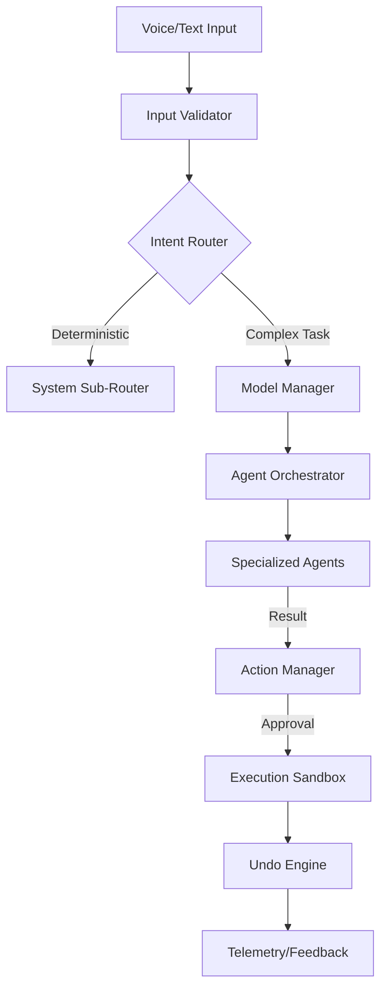

# 🎙️ Sherly AI: Voice-First Local Dev Orchestrator

[](https://opensource.org/licenses/MIT)
[](https://www.python.org/downloads/)
[](#)
[](#)
[](#)

**Sherly AI** is a professional-grade, desktop-native developer assistant designed for the era of high-autonomy coding. By blending low-latency voice control with a deterministic safety layer, Sherly empowers engineers to manage, debug, and optimize their projects hands-free, without sacrificing security or machine integrity.

---

## 🌟 Overview

Sherly is not just another chatbot; it is an **orchestrator** of your local development environment. It executes terminal commands, performs multi-monitor visual analysis, applies semantic code patches, and initiates autonomous self-healing loops—all through a strictly controlled human-in-the-loop workflow.

### 💎 Unique Selling Points (USP)
- **Voice-Native Execution**: Powered by `faster-whisper` for sub-second intent recognition.
- **Hardware-Aware Intelligence**: Automatically scales models based on available system RAM/VRAM.
- **Deterministic Routing**: Zero-latency execution for known tasks without unnecessary LLM involvement.
- **Atomic Undo Engine**: Persistent SQLite-backed history allows full reversibility of every file change.
- **Secure by Design**: Integrated sandbox execution and SOC2-compliant log sanitization.

---

## 🚀 Core Features

### 🛡️ Human-in-the-Loop Safety
Sherly implements a 3-tier intent firewall to protect your system:
- **SAFE**: Read-only tasks (e.g., "Explain this file") run instantly.
- **CONFIRM**: Modifications (e.g., "Install dependencies") require explicit user approval.
- **DANGEROUS**: High-risk actions are blocked or routed through a containerized sandbox.

### 📂 Semantic Patching & Preview
Before applying any change, Sherly provides:
- **Interactive Diff Previews**: Hunk-level approval support for surgical code modifications.
- **Confidence Scoring**: Real-time probability of fix success based on error analysis.
- **Automatic Backups**: Every write is preceded by a snapshot for instant recovery.

### 🔄 Autonomous Self-Healing
When a project fails, Sherly initiates a recovery cycle:
1. **Detection**: Captures runtime errors and stack traces.
2. **Analysis**: Correlates errors with the codebase via ChromaDB-backed RAG.
3. **Proposal**: Generates a corrective patch with a documented rationale.
4. **Validation**: Re-runs the project to ensure the fix is successful.

### 🧠 Advanced RAG Memory
Utilizes **ChromaDB** for deep repository indexing, allowing Sherly to provide architectural insights that simple chat history cannot.

---

## 🏗️ Architecture

Sherly utilizes a modular "Sub-Router" architecture to ensure maintainability and performance.


```mermaid
graph TD
    A[Voice/Text Input] --> B[Input Validator]
    B --> C{Intent Router}
    C -->|Deterministic| D[System Sub-Router]
    C -->|Complex Task| E[Model Manager]
    E --> F[Agent Orchestrator]
    F --> G[Specialized Agents]
    G -->|Result| H[Action Manager]
    H -->|Approval| I[Execution Sandbox]
    I --> J[Undo Engine]
    J --> K[Telemetry/Feedback]
```

---

## 🛠️ Tech Stack

- **UI Framework**: PySide6 (Premium Glassmorphism Design)
- **Inference Engines**: Ollama (Local), Gemini/OpenAI/Groq (Cloud Fallbacks)
- **Voice/STT**: Faster-Whisper (Int8 Quantized)
- **Vector DB**: ChromaDB (Persistent Semantic Memory)
- **Security**: Fernet Encryption & Regex-based Log Sanitization
- **Network**: FastAPI (Multi-user Remote Gateway)

---

## ⚙️ Installation

### Prerequisites
- Python 3.10+
- [Ollama](https://ollama.ai/) (For local LLM execution)
- 8GB+ RAM recommended (Sherly scales automatically to lower RAM)

### Step-by-Step Setup
1. **Clone the repository**:
   ```bash
   git clone https://github.com/yourusername/sherly.git
   cd sherly
   ```
2. **Setup Virtual Environment**:
   ```bash
   python -m venv venv
   source venv/bin/activate  # Windows: venv\Scripts\activate
   ```
3. **Install Dependencies**:
   ```bash
   pip install .
   ```
4. **Initialize Environment**:
   Copy `.env.example` to `.env` and add your cloud API keys (optional).
5. **Launch**:
   ```bash
   python main.py
   ```

---

## 📂 Folder Structure

```text
├── agents/               # Specialized AI agents (Coder, System, Browser)
├── core/                 # Core engines (RAG, Sandbox, Encryption, Sanitizer)
├── routers/              # Domain-specific sub-routers (File, Dev, System)
├── sherly_ui/            # PySide6 desktop interface and assets
├── tools/                # Extensible toolset (STT, TTS, Screen Analysis)
├── tests/                # Comprehensive Pytest suites
├── action_manager.py     # Persistent approval queue and history
├── command_router.py     # Master intent orchestrator
├── model_manager.py      # Hardware-aware LLM routing
└── pyproject.toml        # Modern dependency management
```

---

## 🔐 Security Considerations
- **Log Sanitization**: Every telemetry log passes through `core/sanitizer.py` to strip PII and secrets.
- **At-Rest Encryption**: Sensitive configuration and history are encrypted using `core/encryption.py`.
- **Sandbox Execution**: High-risk tasks are executed in an isolated temporary environment.

---

## 🤝 Contributing
We welcome contributions! Please follow our [CONTRIBUTING.md](CONTRIBUTING.md) and ensure all PRs pass the existing `pytest` suite.

---

## 📄 License
This project is licensed under the MIT License - see the [LICENSE](LICENSE) file for details.

## ✍️ Author
Designed for the next generation of high-autonomy software engineering.
