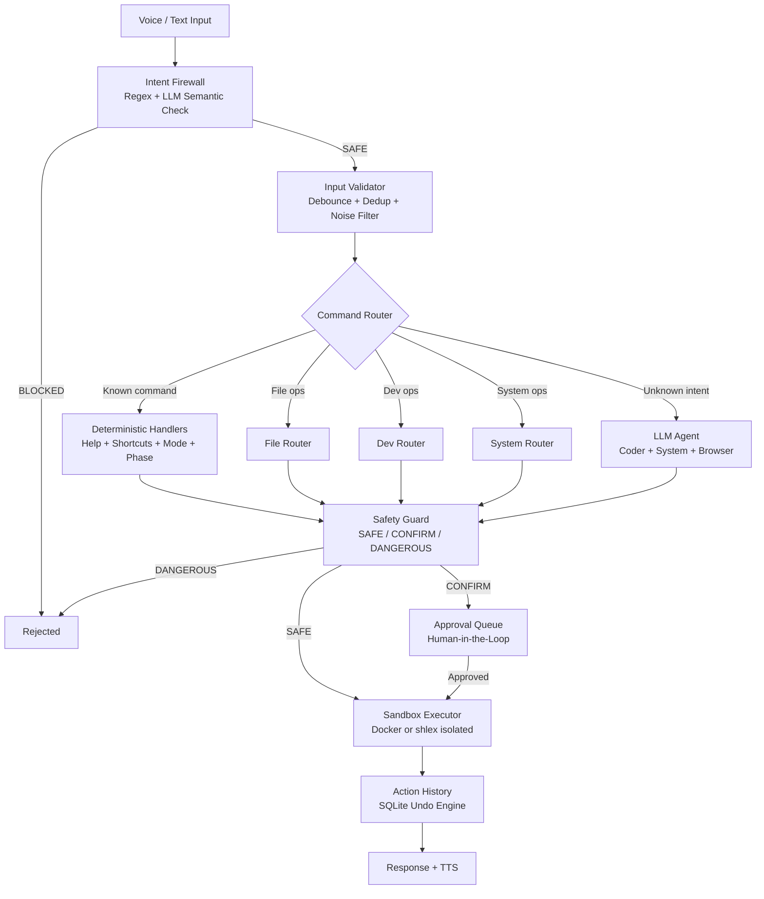

# 🎙️ Sherly AI: Voice-First Local Dev Copilot

[](https://opensource.org/licenses/MIT)
[](https://www.python.org/downloads/)
[](#)
[](#)

**Sherly AI** is a professional-grade, desktop-native developer assistant designed for the modern era of high-autonomy coding. By blending voice-controlled execution with a strict deterministic safety layer, Sherly empowers developers to manage, debug, and optimize their projects hands-free, without sacrificing control or security.

---

## 🌟 Overview
Sherly transforms the developer experience by moving beyond simple chat interfaces. It acts as an **orchestrator** of your local environment—executing terminal commands, analyzing screens, applying multi-file code patches, and self-healing project errors—all while maintaining a human-in-the-loop approval workflow.

### 💎 Why Sherly?
- **Voice-Native**: Integrated `faster-whisper` ensures low-latency, high-accuracy voice commands even in noisy environments.
- **Safety First**: A 3-tier classification system (SAFE/CONFIRM/DANGEROUS) protects your machine from destructive AI experiments.
- **Deterministic Routing**: Known shortcuts execute instantly without LLM involvement, reducing latency and cost.
- **Total Reversibility**: A built-in Undo Engine lets you revert file writes and system changes with a single word.

---

## 🚀 Key Features

### 🛡️ Human-in-the-Loop Safety
Sherly categorizes every intent before execution:
- **SAFE**: Information retrieval (e.g., "explain this file") runs immediately.
- **CONFIRM**: System modifications (e.g., "install dependencies") require distinct user approval.
- **DANGEROUS**: High-risk commands are blocked by default or require high-level overrides.

### 📂 Git-Style Preview & Patching
Before any code modification, Sherly generates a structured preview:
- **Visual Diffs**: See exact line-level additions and removals.
- **Confidence Scoring**: Real-time introspection on the probable success of a fix.
- **Atomic Application**: Apply complex, multi-file fixes with `approve <id>`.
- **Auto-Backups**: Every change is backed up, ensuring you can always roll back.

### 🔄 Self-Healing Debug Loop
When a project fails, Sherly initiates an autonomous recovery cycle:
1. **Detection**: Captures runtime errors and stack traces.
2. **Analysis**: Correlates errors with the codebase to identify the root cause.
3. **Proposal**: Generates a corrective patch with a success probability score.
4. **Validation**: Re-runs the project after approval to ensure the fix sticks.

### 🧠 Advanced Contextual Memory
Sherly tracks your project's state across sessions:
- **Conversation Context**: Keeps track of current tasks and recent discussions.
- **Preference Persistence**: Remembers your preferred editor, language, and project paths.
- **Knowledge Brain**: Stores and recalls custom snippets or configuration keys.

---

## 🏗️ Architecture
Sherly is built on a modular "Pillar" architecture designed for reliability and extensibility.


```mermaid
flowchart TD
    A[Voice / Text Input] --> B[Intent Firewall<br/>Regex + LLM Semantic Check]

    B -->|SAFE| C[Input Validator<br/>Debounce + Dedup + Noise Filter]
    B -->|BLOCKED| X[Rejected]

    C --> D{Command Router}

    D -->|Known command| E[Deterministic Handlers<br/>Help + Shortcuts + Mode + Phase]
    D -->|File ops| F[File Router]
    D -->|Dev ops| G[Dev Router]
    D -->|System ops| H[System Router]
    D -->|Unknown intent| I[LLM Agent<br/>Coder + System + Browser]

    E --> J[Safety Guard<br/>SAFE / CONFIRM / DANGEROUS]
    F --> J
    G --> J
    H --> J
    I --> J

    J -->|DANGEROUS| X
    J -->|SAFE| L[Sandbox Executor<br/>Docker or shlex isolated]
    J -->|CONFIRM| K[Approval Queue<br/>Human-in-the-Loop]

    K -->|Approved| L
    L --> M[Action History<br/>SQLite Undo Engine]
    M --> N[Response + TTS]
```

---

## 🛠️ Tech Stack
- **Core**: Python 3.10+, PySide6 (UI), FastAPI (Remote Interface)
- **AI/ML**: Ollama (Local), Gemini/OpenAI/Groq (Cloud), Faster-Whisper (STT), Pyttsx3 (TTS)
- **Utilities**: `diff-lib` (Patching), `MSS` (Vision), `DuckDuckGo` (Search), `ntfy` (Notifications)

---

## 📂 Folder Structure
```text
├── agents/               # Specialized AI agents (Browser, System, Coder)
├── core/                 # Async task queue and worker engines
├── sherly_ui/            # PySide6 desktop interface and tray integration
├── tools/                # Extensible toolset (STT, TTS, Preview, Fix engine)
├── action_manager.py     # Approval queue and Undo/Redo logic
├── command_router.py     # Deterministic and LLM-based intent routing
├── input_validator.py    # Prompt injection and safety filtering
├── model_manager.py      # LLM orchestration and prompt engineering
├── runtime_utils.py      # Safe execution and thread-safe logging
└── requirements.txt      # Project dependencies
```

---

## ⚙️ Installation

### Prerequisites
- Python 3.10 or higher
- [Ollama](https://ollama.ai/) (For local LLM support)
- Microphone access (For voice features)

### Setup
1. **Clone the repository**:
   ```bash
   git clone https://github.com/yourusername/sherly.git
   cd sherly
   ```
2. **Install dependencies**:
   ```bash
   pip install -r requirements.txt
   ```
3. **Initialize Configuration**:
   Create a `config.json` in the root directory (or use the UI to configure models).
4. **Launch Sherly**:
   ```bash
   python main.py
   ```

---

## 📖 Usage Guide

### Voice Commands
- **Debugging**: *"Sherly, fix my project"* (Triggers the self-healing loop).
- **Execution**: *"Run my project"* or *"Run command pip install requests"*.
- **Code Insight**: *"Explain this code"* (Analyzes the current clipboard content).
- **Vision**: *"What is on my screen?"* (Triggers OCR and visual analysis).

### Control & Admin
- **Approval**: `approve <id>` (Executes a pending action).
- **Undo**: `undo last action` (Reverts the most recent file change).
- **Modes**: `switch to dev mode` (Increases technical verbosity and depth).

---

## 🔐 Security & Privacy
- **Local-First**: By default, Sherly uses local models via Ollama, keeping your code off public servers.
- **Safety Guards**: All terminal commands pass through a safe-execution whitelist.
- **Approval Gates**: Critical actions (file writes, deletes, network calls) expire and require explicit tokens.

---

## 🤝 Contributing
We welcome contributions! Please see our [CONTRIBUTING.md](CONTRIBUTING.md) for guidelines on how to submit pull requests and report issues.

## 📄 License
This project is licensed under the MIT License - see the [LICENSE](LICENSE) file for details.

## ✍️ Author
Designed and maintained by **[Your Name/Organization]**.
Dedicated to making AI automation safe, fast, and accessible.
