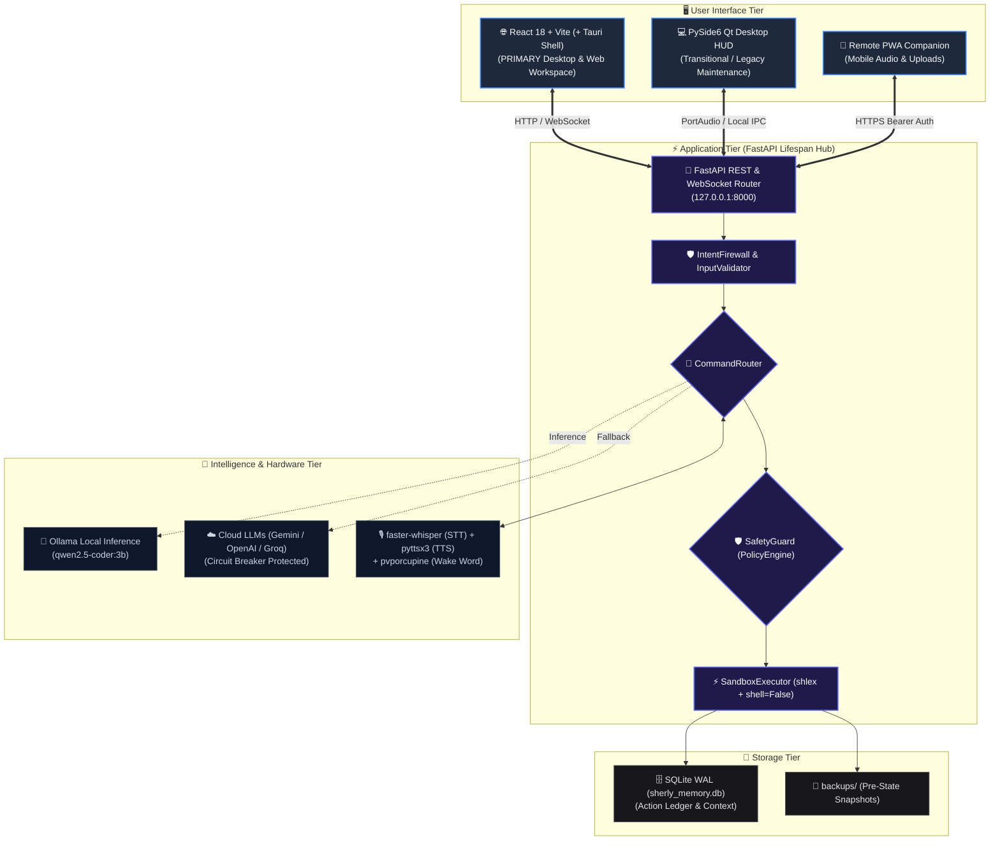
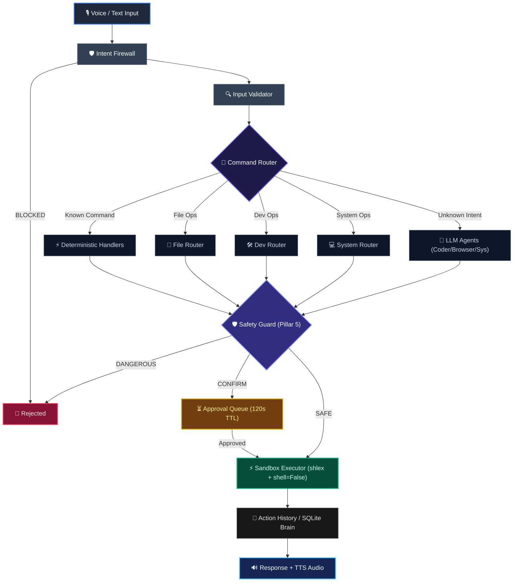

# Sherly AI — Complete Architecture Specification

**Target Version**: 2.0.0  
**Classification**: Enterprise Architecture & System Topology Specification  
**Status**: ACTIVE & VERIFIED  

---

## 1. Executive System Topology (C4 Level 1 & 2)

Sherly is structured as an asynchronous, event-driven local developer orchestrator. It couples hardware voice pipelines, local LLM inference engines, and a zero-trust AST execution sandbox into a unified developer environment.



---

## 2. Component Routing & Policy Architecture (C4 Level 3)



---

## 3. Concurrency, State & Memory Model

1. **Active-Model Lock**: A thread-safe `threading.Lock` in `model_manager.py` prevents concurrent multi-model VRAM loading.
2. **Idle VRAM Unloader**: A background daemon thread releases GPU memory via Ollama `keep_alive: 0` after 120 seconds of inactivity.
3. **SQLite WAL Concurrency**: `sherly_memory.db` executes with `PRAGMA journal_mode=WAL` and `PRAGMA synchronous=NORMAL`, allowing non-blocking concurrent readers during active background writes (14,184 ops/sec).
4. **WebSocket Stream Coalescing**: Token stream chunks are coalesced at 60 FPS (~16ms/frame) via `requestAnimationFrame` before React state commit.

---

## 4. Multi-Modal Execution Convergence

All user interfaces (React Workspace, Native PySide6 Qt HUD, and Remote PWA Companion) converge on the exact same backend policy engine:

```text
┌─────────────────┐   ┌─────────────────┐   ┌─────────────────┐
│  React 18 UI    │   │  PySide6 Qt HUD │   │  Remote PWA     │
└────────┬────────┘   └────────┬────────┘   └────────┬────────┘
         │                     │                     │
         └─────────────────────┼─────────────────────┘
                               ↓
                   Canonical Request Router
                               ↓
                       Input Sanitization
                               ↓
                       PolicyEngine Check
                               ↓
                ┌──────────────┴──────────────┐
              [SAFE]                 [CONFIRM / DANGEROUS]
                │                              │
                │                     Generate Action ID
                │                              │
                │                  Approval Dialog / Preview
                │                              │
                │                    User Approves/Rejects
                │                              │
                └──────────────┬───────────────┘
                               ↓
                   safe_exec (shell=False)
                               ↓
                    Backup & SQLite Logging
```
