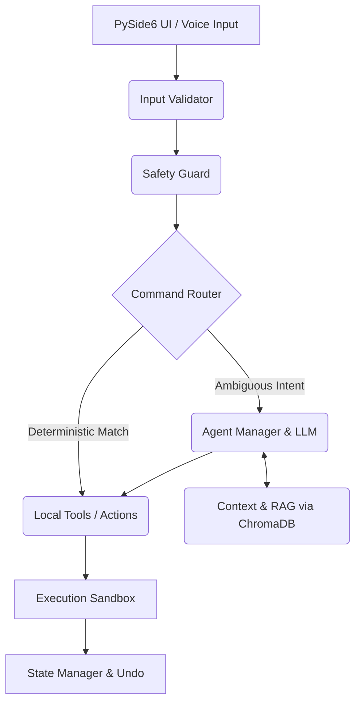

# System Architecture

Sherly AI operates on a **Deterministic-First, Local-First** architecture. This document outlines the core components, data flow, and safety mechanisms that make up the system.

## 🏢 High-Level Architecture

The system is broken down into several independent modules that communicate through a central `CommandRouter`.

## 🧩 Core Modules

### 1. `sherly_ui` (Frontend)
Built with PySide6, this module handles all user interactions. It captures voice input (via `faster-whisper`), displays the interactive patch approvals (Git-style previews), and handles system tray integration.

### 2. `sherly_core` (Orchestration)
The brain of the system.
- **`command_router.py`**: The deterministic router. It intercepts commands and decides if an action can be performed directly by a known tool (e.g., "list files") or if it requires LLM reasoning (e.g., "fix this bug").
- **`action_manager.py`**: Tracks execution history, manages atomic undos, and stages file modifications for preview.

### 3. `models` & `agents` (AI Layer)
- **`model_scanner.py`**: Detects local Ollama instances and available models.
- **`model_manager.py`**: Handles loading, timeout, and unloading of models to conserve VRAM.
- **`agent_manager.py`**: Instantiates specialized agents based on the task (e.g., scaffolding, debugging).

### 4. `core/safety_guard.py` (Security)
Evaluates inputs and outputs.
- Checks for prompt injection.
- Redacts secrets.
- Classifies actions into `SAFE`, `CONFIRM`, and `DANGEROUS`.

## 🔄 Data Flow: Example (Voice Command)

1. **Input**: User presses `Ctrl+Shift+S` and says, "Fix the authentication bug."
2. **STT**: `faster-whisper` transcribes audio to text locally.
3. **Validation**: `input_validator.py` cleans the text and checks for injections.
4. **Routing**: `command_router.py` fails to find a deterministic match, routes to `agent_manager.py`.
5. **Context Loading**: Agent queries `memory_brain.py` (ChromaDB) for files related to "authentication".
6. **LLM Generation**: Ollama generates a patch.
7. **Safety Check**: `safety_guard.py` flags the patch as `CONFIRM` (because it modifies files).
8. **Preview**: `action_manager.py` stages the diff in the PySide6 UI.
9. **Approval**: User types or clicks `approve`.
10. **Execution**: File is modified, prior state backed up for `undo`.
