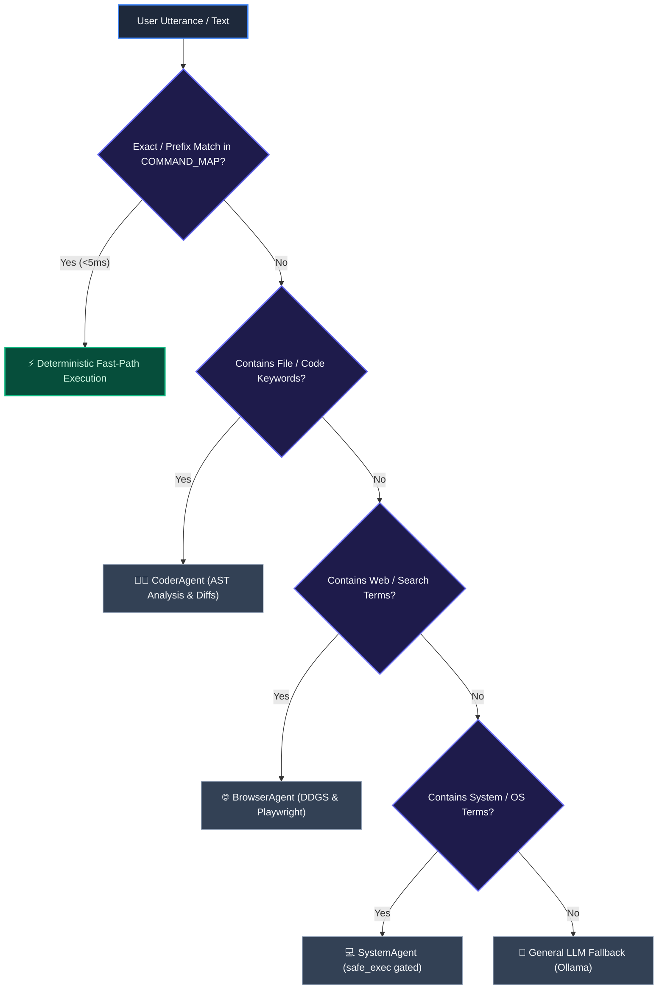

# Sherly AI — Complete Command Catalog & Natural Language Intent Mapping

**Target System**: Command Router, Natural Language Classifier, Deterministic Handlers  
**Version**: 2.0.0  

---

## 1. Intent Routing Pipeline

Every incoming voice utterance or text string flows through a layered hierarchy:



---

## 2. Deterministic Command Map (< 5ms Execution)

The following commands bypass LLM inference completely and run in sub-millisecond timeframes:

| Keyword Pattern | Target Subsystem | Action Executed | Safety Risk |
| :--- | :--- | :--- | :--- |
| `lock screen`, `lock computer` | `system_commands.py` | Invokes OS workstation lock (`rundll32.exe`) | `SAFE` |
| `open downloads` | `system_commands.py` | Opens OS downloads folder in Explorer/Finder | `SAFE` |
| `open terminal` | `system_commands.py` | Launches default terminal emulator | `SAFE` |
| `mute audio`, `unmute audio` | `system_commands.py` | Toggles system sound master mute | `SAFE` |
| `volume up`, `volume down` | `system_commands.py` | Increments/decrements volume levels | `SAFE` |
| `show history`, `action history`| `memory.py` | Queries SQLite action ledger & prints turns | `SAFE` |
| `undo`, `undo last action` | `action_manager.py` | Reverts most recent file modification from backup | `CONFIRM` |
| `approve <action_id>` | `action_manager.py` | Executes staged action ticket and creates snapshot | `CONFIRM` |
| `reject <action_id>` | `action_manager.py` | Dismisses and purges pending action ticket | `SAFE` |
| `git status`, `git branch` | `terminal_tools.py` | Executes `git status` / `git branch` directly | `SAFE` |
| `git diff` | `terminal_tools.py` | Returns working tree unified diff output | `SAFE` |

---

## 3. Natural Language Intent Mapping Guide

When commands are not exact matches, natural language classifiers extract intent and route to specialized sub-agents:

```text
┌─────────────────────────────────────────────────────────────────────────────────────────────────┐
│ NATURAL LANGUAGE INTENT DISPATCH MATRIX                                                         │
├──────────────────────────────────────┬────────────────────────┬─────────────────────────────────┤
│ Example Natural Language Utterance   │ Dispatched Sub-Agent   │ Tools & Subsystems Invoked      │
├──────────────────────────────────────┼────────────────────────┼─────────────────────────────────┤
│ "Explain the function calculate_tax" │ CoderAgent             │ file_tools.read, AST parser     │
│ "Find where DatabaseError is raised" │ CoderAgent             │ grep_search, symbol resolver    │
│ "Refactor auth middleware to async"  │ CoderAgent             │ preview.generate_diff           │
│ "Run pytest and fix failing tests"   │ Self-Healing Loop      │ executor.run, error_fixer.draft │
│ "Search DuckDuckGo for Pydantic v2"  │ BrowserAgent           │ web_search.search_web           │
│ "Scrape docs from python.org"        │ BrowserAgent           │ playwright_agent.run            │
│ "List all Python files in backend/"  │ SystemAgent            │ file_tools.list_directory       │
│ "Check disk space on drive C:"       │ SystemAgent            │ terminal_tools.safe_exec        │
└──────────────────────────────────────┴────────────────────────┴─────────────────────────────────┘
```

---

## 4. Voice Commands & Global Hotkeys

* **Global Wake Hotkey (`Ctrl + Shift + L`)**: Toggles voice capture mode from any application.
* **Wake Word ("Hey Sherly")**: Hardware-accelerated trigger using Picovoice Porcupine.
* **Voice Interrupt ("Cancel", "Stop listening")**: Immediate audio thread cancellation and TTS playback halt.
