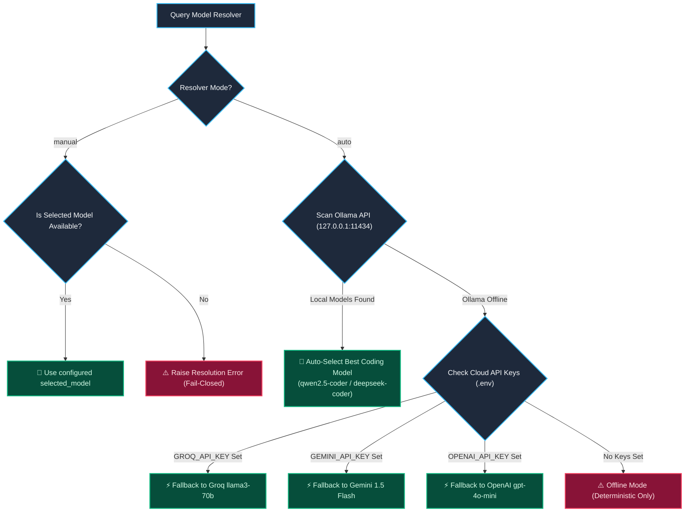

# Sherly AI — Configuration & Model Resolver Guide

**Target System**: Runtime Configuration, Environment Variables, Model Resolution  
**Version**: 2.0.0  

---

## 1. Environment Variables Reference (`.env`)

```ini
# ==============================================================================
# Sherly AI — Production Environment Template
# ==============================================================================

# Network & Server Bindings
SHERLY_PORT=8000
SHERLY_HOST=127.0.0.1

# Remote API Server Authentication (Constant-Time Token)
SHERLY_REMOTE_API_KEY=your_secure_remote_api_key_here

# Optional Cloud Providers (Leave blank for 100% offline Ollama inference)
OPENAI_API_KEY=your_openai_key_here
GEMINI_API_KEY=your_gemini_key_here
GROQ_API_KEY=your_groq_key_here

# Wake-Word Hardware Engine (Picovoice Porcupine)
PVPORCUPINE_ACCESS_KEY=your_picovoice_access_key_here
```

---

## 2. Local Runtime Settings (`config.json`)

`config.json` stores mutable user preferences, audio configurations, and model bindings:

```json
{
  "mode": "auto",
  "selected_model": "qwen2.5-coder:3b",
  "auto_unload_idle_seconds": 120,
  "max_history_turns": 10,
  "voice": {
    "whisper_model": "base.en",
    "tts_rate": 180,
    "tts_volume": 1.0,
    "mic_device_index": null
  },
  "security": {
    "max_upload_size_mb": 10,
    "max_prompt_length": 4000,
    "require_approval_for_writes": true
  }
}
```

---

## 3. Model Resolver Algorithm (`sherly_core/model_resolver.py`)

The Model Resolver determines which model processes incoming requests according to strict prioritization:



---

## 4. Customizing Allowed Binaries (`ALLOWED_PREFIXES`)

To whitelist additional CLI tools for `safe_exec`, update `ALLOWED_PREFIXES` in `tools/terminal_tools.py`:

```python
ALLOWED_PREFIXES: tuple[str, ...] = (
    "python", "pip", "git", "uvicorn", "npm", "node",
    "pytest", "mypy", "ruff", "cargo", "docker", "ollama",
    "echo", "dir", "ls", "cat", "type", "cls", "clear"
)
```
