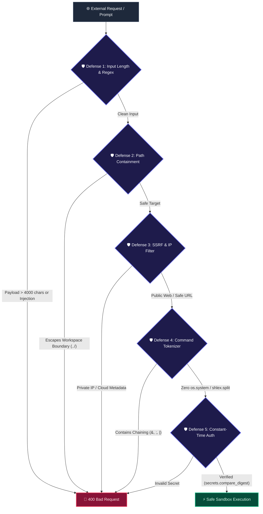

# Sherly AI — Complete Security Architecture & Zero-Trust Sandbox

**Target Version**: 2.0.0  
**Classification**: Zero-Trust System Specification & Threat Mitigation Policy  
**Status**: ACTIVE & VERIFIED  

---

## 1. Zero-Trust Invariant & Boundary Model

Sherly operates under a strict **Zero-Trust Execution Model**. All inputs—including natural language prompts, transcribed voice tokens, LLM tool generation parameters, workspace files, and remote network payloads—are treated as completely untrusted.

The Python backend policy engine (`PolicyEngine`, `safety_guard`, `action_manager`) possesses exclusive, server-authoritative permission to execute tools and filesystem mutations.

---

## 2. Threat Mitigation & Security Controls

| Threat Vector | Mitigation Strategy | Implementation Details |
| :--- | :--- | :--- |
| **Arbitrary Shell Execution** | Zero `shell=True` / 0 `os.system()` | All commands tokenized via `shlex.split()` and executed with `shell=False`. |
| **Command Injection** | Block Chaining Operators | Rejects raw strings containing `&`, `\|`, `;`, `\n`, or backticks. |
| **Command Allowlisting** | `ALLOWED_PREFIXES` Whitelist | Restricts execution strictly to approved developer binaries (`pytest`, `git`, `python`, etc.). |
| **Directory Traversal** | Canonical Chroot Verification | `_get_safe_target()` validates `Path(target).resolve().is_relative_to(ROOT)`. |
| **Server-Side Request Forgery** | Centralized SSRF Network Filter | `core/network_security.py` blocks private subnets (`10.0.0.0/8`, `192.168.0.0/16`, `127.0.0.0/8`) and Cloud metadata (`169.254.169.254`). |
| **Timing Attacks on API Keys** | Constant-Time String Comparison | `secrets.compare_digest()` prevents side-channel timing analysis. |
| **Secret Exfiltration in Logs** | Observability Masking | Regular expressions sanitize and redact API keys and bearer tokens to `[REDACTED]`. |
| **Memory Exhaustion** | Bounded Streaming File Uploads | Upload streams are capped at 10 MB and prompts capped at 4,000 characters. |
| **Action Hijacking & Race Conditions** | Thread-Safe Approval Tickets | Action tickets enforce single-use pop semantics and a strict 120-second Time-To-Live (TTL). |

---

## 3. Production Hardening Checklist

1. **Local Desktop Isolation**: Default configuration binds exclusively to loopback (`127.0.0.1:8000`).
2. **File Permissions**: Set `sherly_memory.db` and `config.json` to owner-only read/write (`chmod 600` on POSIX systems).
3. **Remote Deployment**: Always terminate TLS via reverse proxy (Caddy / Nginx) and configure `SHERLY_REMOTE_API_KEY`.
4. **AST Static Invariant Tests**: Run `pytest tests/test_security.py` in CI to ensure 0 AST nodes introduce dangerous shell invocations.
